# YouTube Live 실시간 요약

- URL: https://www.youtube.com/watch?v=zS_mL3eGPkk
- 시작: 2026-04-25 14:23:08 KST
- 이미지 캡처 간격: 10초
- 오디오 전사 청크: 30초
- 상태: 진행 중

## 핵심 요약

- “2026 주간 도달 던전” 그래프에서 1월 3주와 4월 3주의 던전별 지표를 비교하는 화면이 표시됐다.
- 테스트 서버 환경을 본 서버 캐릭터 상태와 더 가깝게 만들고 반복 세팅 부담을 줄이겠다고 설명했다.
- 세인트 바드 장막 조정은 다음 주 정식 서버 반영을 미루고 테스트 서버를 연장해 안정성을 검증하겠다고 밝혔다.
- 엘레멘탈 나이트 스매시 시전 시간 문제는 전체 스매시 수정 대신 아르카나 링크 보너스 등 한정 개선 방향을 검토하겠다고 답변했다.
- 다크메이지 미티어로이드 인챈트 문제는 공급 증가로 가치가 낮아진 데서 발생했으며, 현 시점에서 효과 직접 조정은 어렵다고 설명했다.
- 종족 밸런스는 엘프=궁술·달리며 스킬, 자이언트=근접/렌스, 인간=프레스 기반 다재다능으로 차별화하되 전투 핵심은 종족 때문에 결정되지 않게 하겠다고 설명했다.
- 기존 장비 가치 하락에 대한 전면 보상이나 모든 상황의 안전장치를 보장하기는 현실적으로 어렵다고 선을 그었다.
- QA 과정의 추가 노력과 준비를 진행 중이라고 밝혔고, QA팀 운영 방식에 대한 질문이 이어졌다.
- 화면상 발언자가 “콘텐츠 리더 강민석”으로 전환된 장면이 확인됐다.
- QA는 국내 인력이 중심이며 해외 인력이 이를 보조하고, 과거보다 더 많은 인원이 QA에 참여 중이라고 설명했다.
- 내부 개발 프로세스 재편을 통해 개발 단계의 버그를 줄이는 것을 우선 과제로 제시했다.
- 테스트 서버에서 제보된 버그가 정식 서버로 넘어가기 전에 안내·일정 재조정 절차를 적용하겠다고 설명했다.
- 초기 화면에서 “마비노기 커넥트 ON AIR”와 “디렉터 최동민” 명패가 확인됐고, 이후 화면상 발언자가 콘텐츠 리더 강민석으로 전환됐다.
- 음성 내용상 개발/업데이트 과정의 문제를 설명하고 있으며, 테스트 서버와 정식 서버 반영 전에 이슈를 충분히 걸러내지 못한 점을 언급했다.
- 레거시 구조와 컨텐츠 연계 특성 때문에 업데이트 영향이 크고, 일정 압박 속에서 반영이 진행됐다는 취지의 설명이 나왔다.
- 다크메이지 미티어로이드/결실 인챈트는 직접 효과 조정보다 가치·활용 메리트를 높이는 방향의 개선을 언급했고, 랜스 차지 위치렉은 구조적 문제가 있어 재개선을 검토하겠다고 답변했다.
- 엘레멘탈 나이트 한정 스매시 개선이 세이크리드 가드 이용자에게 역차별로 느껴질 수 있다는 지적에, 조정 시 세이크리드 가드도 함께 준비하겠다고 답했다.
- 세공 관련 Q&A에서 낚시대 물고기 크기 세공 적용 의혹, 몬스터 보호/보호파괴 한돌 효율과 표기 문제를 확인해보겠다고 밝혔다.
- 화면은 “게임 방향성” 섹션으로 전환되어 중장기 비전, 기존 문제 해결, 업데이트 속도, 패치 기조, 신규/복귀 유저 대책 안건을 보여줬다.

- 확률 표기/세공 가이드 공지 관련 추가 위법 사안과 유저 미공지 문제가 질의됐고, 답변자는 세공 가이드 고지 누락과 세공 도구 확률표 안내 부족을 설명했다.

- 기존 문제 해결 우선순위 질의에서 서버렉·아르카나 밸런스·다계정/매크로·UI·불편 버그 방치 인식이 제기됐고, 답변자는 주간 도달 던전 그래프를 근거로 하위 던전 이용 감소를 우선 수정 대상으로 언급했다.

- 서버렉은 과거 필드레이드 중심 양상과 달리 콘텐츠 업데이트에 따라 상시적으로 발생하는 쪽으로 바뀌었으며, 모니터링 시스템 구축부터 진행 중이라고 설명했다.
- 다계정·매크로는 단순 던전 계정뿐 아니라 뱅커 계정과 재화 유통 경로까지 확인해야 해 즉시 제재가 어렵지만, 전날에도 군집 단위 조치를 했다고 밝혔다.
- “2026 주간 도달 던전” 그래프는 절대값 기준이며 다계정도 포함되어 있으나 내부적으로 이를 검출·판단한다고 답했다.
- 1월 3주와 4월 3주 비교가 프리시즌 여부에 영향을 받는다는 지적에, 내부적으로는 더 긴 기간 데이터를 보고 있으며 신규/복귀 유저 정착 전환율 저하가 더 큰 원인이라고 설명했다.
- 외부 프로그램은 허용하지 않되 레지스트리 수정은 제재하지 않는다고 밝혔고, 다계정/배럭 단속은 로그 기반으로 하되 공개 범위는 제한된다고 설명했다.
- 치명적 버그 재발, 보호모드 오탐 가능성, 알려진 버그 진행 상황을 공지로 공유해 달라는 신뢰 개선 요청이 이어졌다.
- 신규 유저가 퀘스트·아이템 정보를 게임 내에서 찾기 어렵다는 지적과 던전 가이드/스마트 콘텐츠 업데이트 요구가 제기됐고, 개선하겠다고 답변을 시작했다.

- 신규 유저 정보 접근성 답변에서는 퀘스트 자동 길찾기·정보 제공 공간 확대를 시도했지만 누적 정보 안내가 아직 부족하다고 인정했다.
- 힐링 원드 에르그 재료와 하시딤 미션 접근성 질의에서, 하시딤 미션 완화 또는 재료 지급처를 주요 콘텐츠/성장 과정으로 확장하는 두 방향을 검토 중이나 결론은 나지 않았다고 밝혔다.
- 현장 후속 의견으로 에르그를 골드로 개방하는 등 재료 의존을 낮추는 대안이 제안됐고, 개발 측도 하시딤 완화보다 별도 성장 트랙·재료 의존 완화 방향을 준비하겠다고 답했다.

- 에르그 접근성 후속 논의에서 하시딤 완화보다 자연스러운 별도 성장 트랙·재료 의존 완화 방향을 준비하겠다고 답했다.
- 소규모 서버는 하시딤 정석 공략 최소 인원 모집 자체가 어렵다는 의견이 나왔고, 에르그를 더 자연스럽게 획득할 수 있게 고려하겠다고 답변했다.
- 멜로디 퍼피티어 도입으로 인형 생존력·방어·부활 관련 에르그/핸들/개조/정령 효과가 무의미해진 문제를 인정하고, 노후화 기능 전반과 함께 하반기 개선을 준비하겠다고 밝혔다.
- 힐링 원드 에르그 추가로 인한 에르그 수요·가치 변화 대응은 당장 계획에 없다고 답했다.
- 다클라를 유발하는 보상 구조를 두고 브리레어식 공통 보상, 개인 보상, 기본 골드 보상, 낮은 보상상자 추가 가능성을 비교 중이지만 아직 결론은 없다고 밝혔다.
- 유저는 운영 측이 최종 방향을 정하고 그 내용을 설득해야 한다고 요구하며, 실패한 업데이트의 원인을 설명 부족으로 지적했다.
- 마무리 공지에서 메크로 계정 5개가 추가 발견돼 즉시 제재됐고, 오후 5시까지 휴식하며 프린트물과 진행 순서를 준비하겠다고 안내했다.

- 후반부에는 다클라 유발 보상 구조의 최종 방향, 동일 사양 아이템 정리, 펫/캐릭터/은행 편의 개선, 레거시 콘텐츠 통합 한계, 자료 공유 요청 같은 운영·편의성 이슈가 집중됐다.
- 휴식 직전 대기 화면의 카운트다운은 05:37에서 02:07로 줄었고, 이후 디렉터 최동민이 다시 ON AIR 패널 화면에서 발언하는 장면이 확인됐다.
- 후반부 최신 캡처에서는 객석 참가자가 무선 마이크로 이어서 발언하는 장면이 포착됐고, 해당 구간 STT는 비어 있어 세부 질문 내용은 확인되지 않았다.
- 17:55대 최신 화면에서 "게임 방향성"의 운영 탭 질문 슬라이드가 다시 크게 보였고, 솔로 플레이·재미 개선·유저 감소 위기감·시골 서버 인구 부족/서버 통합 같은 질문 목록과 설문 기간이 확인됐다.
- 18시대 음성에서는 브리레 대비 보상감, 크롬바스 시면(4인 던전)과 고리아스의 완만한 난이도 설계가 추가로 논의됐다.
- 시즌별 이벤트·키트 주기 불안도 제기됐으며, 두근두근 아일랜드·올밍 키트가 오래 비어 있었다는 지적이 나왔다.
- 최신 화면은 객석 질의응답 중 "마비노기 커넥트 ON AIR"가 다시 보이는 현장 장면으로 확인됐다.
- 신규 이벤트와 새 콘텐츠 도입은 상반기 중에는 어려울 수 있지만 계속 고민하겠다고 답했다.
- 브리레 던전은 반복 스킬과 강제 이동뿐 아니라 50% 구간의 전조 없는 기믹, 운으로 대처하는 패턴, 파티 전멸 압박 같은 불쾌 요소가 있어, 고리아스에서는 실수 시 개인 죽음 중심으로 완화하고 실력으로 커버할 수 있게 하겠다고 언급했다.
- 딜캡은 상위 난이도에서는 필요하지만 하위 던전에서는 원래 한방에 잡을 몬스터가 막혀 시간만 늘어나는 불쾌감이 있어, 하위 던전은 딜로 스킵 가능한 형태로 조정하겠다고 설명했다.
- 유저 수 감소 위기감에 대해서는 책임감을 느끼고 있고, 마비노기를 다시 즐거운 게임으로 만들어 친구 초대와 복귀를 유도하겠다고 답했다.
- 시골 서버 인구 부족과 서버 통합은 기술적 문제와 류트 서버 렉/DB 부하 때문에 현재 어렵다고 설명했다.

## 타임라인

> 이 영상은 질의응답 중심이므로, 음성 항목은 “질문 주제 → 답변/약속/한계/후속 요청” 구조로 묶어 정리한다.

| 시간 | 유형 | Q&A/화면 요약 | 근거 |
|---|---|---|---|
| 14:23~14:24 | 화면 | “마비노기 커넥트 ON AIR”, “디렉터 최동민” 명패가 보이며 질의응답 답변 장면 시작 | `captures/frame_000002.jpg` 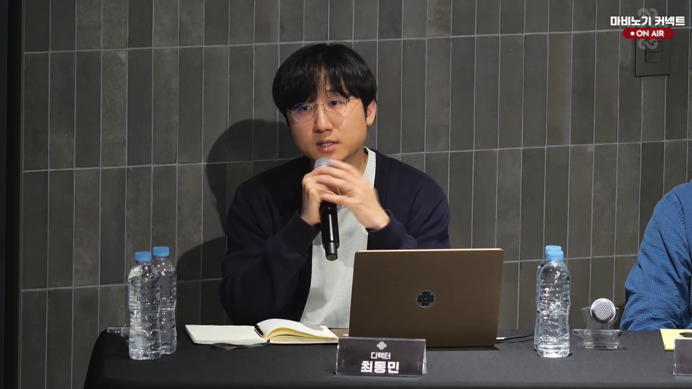 `captures/frame_000006.jpg` 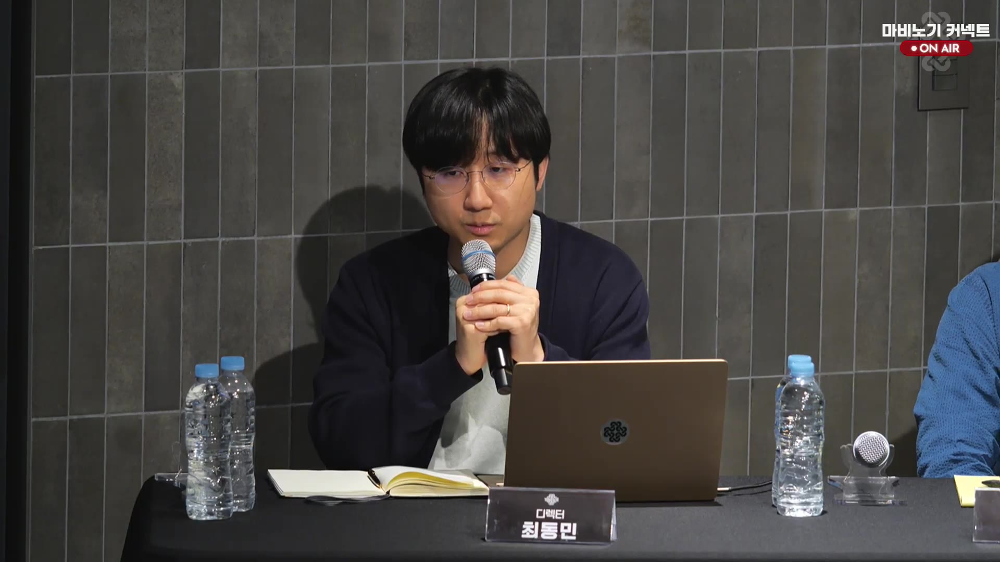 |
| 14:23:08~14:25:08 | 음성/Q&A | 질문 주제: 개발·QA 검증 부족 및 정식 서버 반영 문제 → 답변: 개발 과정의 이슈 누적, 레거시 구조와 콘텐츠 연계 영향, 일정 압박으로 테스트/정식 서버 반영 전 충분히 걸러내지 못한 점을 인정. 약속: 내부 개발 프로세스 재편을 통해 개발 단계의 버그를 줄이는 것을 최우선으로 하겠다고 설명 | `transcripts/chunk_000000.txt`~`transcripts/chunk_000003.txt` |
| 14:25:08~14:27:08 | 음성/Q&A | 질문 주제: QA팀 운영 방식과 해외 QA 여부 → 답변: QA 내부 보강을 진행 중이나 세부 체계 개편은 충분히 설명하기 어렵다고 전제. 국내 QA 인력이 중심이고 해외 인력이 보조하며, 과거보다 더 많은 인원이 QA에 참여 중이라고 설명. 한계: 업데이트 범위와 방향을 많이 챙기려다 디테일을 놓친 점을 인정 | `transcripts/chunk_000004.txt`~`transcripts/chunk_000007.txt` |
| 14:27:08~14:29:08 | 음성/Q&A | 질문 주제: 나팔/열병 튀김 등 사례가 QA뿐 아니라 기획 문제 아닌가 → 답변: 발생해서는 안 되는 상황이며 실제 플레이 관점에서 말이 안 되는 상황이라는 지적에 부끄럽다고 답변. 개발자·QA 과정에서 걸러졌어야 했고, 주변 작업물을 챙기기 어려웠던 운영 부실을 원인으로 인정하며 개선하겠다고 마무리 | `transcripts/chunk_000008.txt`~`transcripts/chunk_000011.txt` |
| 14:29:08~14:30:38 | 음성/Q&A | 질문 주제: 테스트 서버 환경 개선 요청 → 질문 내용: 캐릭터 스킬/단축키/펫 재세팅, 유저 레벨 기준 강제 복사, 인챈트·유물·세공 등 반복 작업 때문에 실제 테스트가 어렵고 본 서버와 동일한 환경 연동·반복 요소 간소화·핫픽스 주기 개선이 필요하다고 지적 | `transcripts/chunk_000012.txt`~`transcripts/chunk_000014.txt` |
| 14:30:38~14:31:08 | 화면 | 발언자 명패가 “콘텐츠 리더 강민석”으로 전환되어 테스트 서버 환경 관련 답변자가 바뀐 장면 확인 | `captures/frame_000060.jpg` 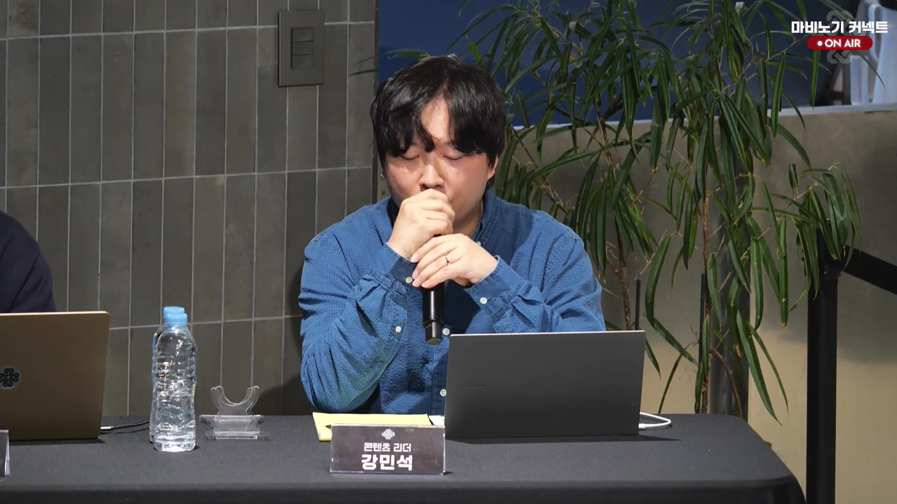 |
| 14:30:38~14:34:38 | 음성/Q&A | 질문 주제: 테스트 서버 환경·핫픽스·테스트 기간 연장 → 답변자: 콘텐츠 리더 강민석. 답변: 정식 서버 캐릭터 환경을 테스트 서버에서 즉시 사용할 수 있게 준비하고, NPC 지원만으로는 부족하다는 점에 공감. 약속: 반복 세팅 부담 개선, 세이크리드 가드/세바 개편 테스트 이슈는 더 빠르게 대응. 추가 답변: 세인트 바드 장막 조정은 다음 주 정식 서버 반영을 미루고 테스트 서버를 연장해 안정성을 검증하겠다고 설명 | `transcripts/chunk_000015.txt`~`transcripts/chunk_000022.txt` |
| 14:34:38~14:35:08 | 음성/Q&A | 후속 요청: 패시브·인챈트·세공 같은 확률 기반 준비 요소와 테스트 리포트 글자 수 제한도 유저 신뢰와 관련되므로 개선해달라고 요청. 답변: 관련 내용은 추후 더 자세히 다루겠다고 안내 | `transcripts/chunk_000023.txt` |
| 14:35:08~14:39:38 | 음성/Q&A | 질문 주제: 기존 전투 문제 해결 우선순위 → 질문 내용: 엘레멘탈 나이트 스매시 시전 시간, 블래스트 랜서 렌스 차지 캔슬/위치렉, 다크메이지 미티어로이드 인챈트 문제 해결 여부. 답변: 모두 수정되어야 할 문제라고 인정하되, 스매시는 전체 무기 공통 스킬이라 전면 수정이 어렵고 위치렉 악화 가능성이 있다고 설명. 대안: 엘레멘탈 나이트 선택/아르카나 링크 보너스 형태로 스매시 시전 시간 개선을 준비해보겠다고 답변. 한계: 미티어로이드 직접 효과 조정은 현 시점에서 어렵다고 설명 시작 | `transcripts/chunk_000024.txt`~`transcripts/chunk_000032.txt` |
| 14:39~14:42 | 음성/Q&A | 질문 주제: 다크메이지 인챈트 가치·랜스 차지 위치렉·세이크리드 가드 형평성 → 답변: 미티어로이드/결실 인챈트는 직접 효과 조정보다 활용 메리트를 높이는 방향을 언급. 랜스 차지 위치렉은 이동 속도 관련 구조적 버그가 반복되는 문제라 재개선을 검토하겠다고 답변. 후속 지적: 엘레멘탈 나이트만 스매시를 개선하면 세이크리드 가드 이용자에게 역차별이 될 수 있음 → 답변: 조정 시 세이크리드 가드도 함께 준비하겠다고 답함 | `transcripts/chunk_000033.txt`~`transcripts/chunk_000037.txt` |
| 14:42~14:47 | 음성/Q&A | 질문 주제: 세공 옵션 실효성·효과 표기 문제 → 질문 내용: 낚시대 물고기 크기 세공 적용 의혹, 몬스터 보호 공식, 스크류 어퍼 보호파괴 한계돌파 효율 등 고가 옵션 효용을 유저가 직접 실험해야 하는 구조를 지적. 답변: 적용 안 되는 옵션은 없는 것으로 알고 있으나 물고기 크기 분포/예외 가능성은 재확인하겠다고 답변. 한계/약속: 세공만이 아니라 품질·스킬 효과 표기 부족 문제로 보고 있으며 하반기 표기 개선과 연결해 설명 | `transcripts/chunk_000038.txt`~`transcripts/chunk_000047.txt` |
| 14:47:08~14:51:38 | 음성/Q&A | 질문 주제: 확률 표기 위반·세공 가이드 고지 누락·추가 위법 사안 미공지 → 질문 내용: 기관 답변상 추가 위법 사안과 행정조치 예정이 있었는데 유저 공지가 없었다는 신뢰 문제 제기. 답변: 세공 옵션 중첩 미등장 고지가 가이드 개편 중 휴먼 에러로 누락됐고 제보 후 수정했으며, 세공 도구 구매 과정의 확률표 안내도 부족했던 것으로 설명. 후속 요청: 실질 효력이 없는 한돌 아이템 전체 검수 요청 → 답변: 놓친 부분은 당연히 개선해야 하며 함께 개선하겠다고 답변 | `transcripts/chunk_000048.txt`~`transcripts/chunk_000056.txt` |
| 14:51:38~14:53:38 | 음성/Q&A | 질문 주제: 신규 업데이트보다 기존 문제 해결에 집중할 때의 우선순위 → 질문 내용: 서버렉, 아르카나 밸런스, 다계정/매크로, NPC별 UI, 손해·불편 버그 방치 인식 등 우선순위 공개 요청. 답변: 모든 문제를 케어해야 하지만 내부 우선순위가 있으며, 설명을 위해 주간 도달 던전 그래프를 요청 | `transcripts/chunk_000057.txt`~`transcripts/chunk_000060.txt` |
| 14:53:38~14:55:38 | 음성/Q&A | 질문 주제: 주간 도달 던전 그래프 기반 우선순위 → 답변: 상위 일부 던전보다 울라 던전~크롬 바스·몽환의 라비·글렌 베르나 등 하위/성장 구간 플레이 인원이 크게 줄어 이를 최우선 수정 대상으로 본다고 설명. 약속/방향: 신규·복귀/정착 단계 이용자의 성장 환경 조성을 가장 높은 우선순위로 두고, 다계정·밸런스·서버렉도 병행 개선 대상이라고 설명 | `transcripts/chunk_000061.txt`~`transcripts/chunk_000064.txt` |
| 14:55:38~14:57:38 | 음성/Q&A | 질문 주제: 서버렉과 다계정·매크로 대응 → 답변: 서버렉은 과거 특정 필드레이드 시간대 중심에서 콘텐츠 업데이트 후 상시 발생 양상으로 바뀌었고 모니터링 시스템을 구축 중. 다계정·매크로는 던전 수행 계정뿐 아니라 뱅커 계정과 재화 유통 경로까지 로그로 봐야 해 즉시 제재가 어렵지만, 전날에도 군집 단위 조치를 했다고 설명 | `transcripts/chunk_000065.txt`~`transcripts/chunk_000068.txt` |
| 14:57:38~15:01:08 | 음성/Q&A | 질문 주제: 주간 도달 던전 그래프 해석 → 질문: 그래프가 절대값인지, 다계정 포함 여부, 1월 3주와 4월 3주 비교가 프리시즌 여부에 영향을 받는지 제기. 답변: 그래프는 절대값이며 다계정도 포함되지만 내부적으로 검출·판단한다고 설명. 한계/보완: 공개 그래프는 특정 시점 스냅샷이고 내부적으로 더 긴 기간 데이터를 보며, 프리시즌·다계정 영향보다 신규/복귀 유저 정착 전환율 저하가 더 큰 원인이라고 설명 | `transcripts/chunk_000069.txt`~`transcripts/chunk_000075.txt` |
| 14:58 | 화면 | “게임 방향성” 섹션 화면으로 전환. 운영 탭에서 중장기 개발 방향, 기존 문제 해결 집중, 업데이트 속도/콘텐츠 부족, 패치 기조, 신규·복귀 유저 대책 안건이 표시됨 | `captures/frame_000209.jpg` 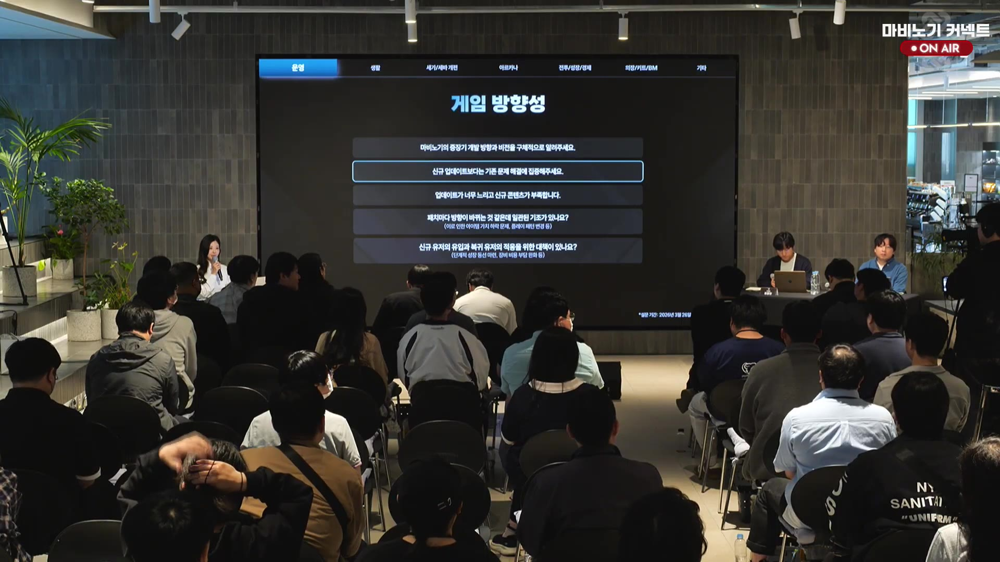 |
| 15:01 | 화면 | “2026 주간 도달 던전” 막대그래프 화면. 비교 기간(1월 3주)과 집계 기간(4월 3주)을 울라 상급 하드모드, 테흐 두인, 몽환의 라비, 크롬 바스, 글렌 베르나, 브리 레흔 등 던전별로 비교 | `captures/frame_000226.jpg` 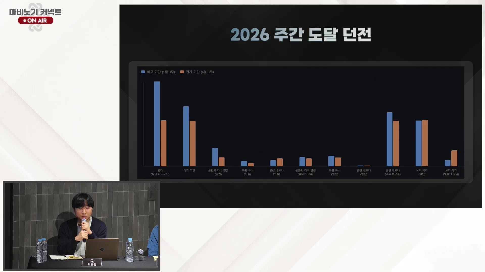 |
| 15:01:08~15:02:08 | 음성/Q&A | 질문 주제: 신규 유저 정보 접근성 → 질문: 오래된 게임 데이터 때문에 퀘스트·아이템 정보를 인터넷 검색이나 주변 도움에 의존해야 하고, 던전 가이드·스마트 콘텐츠가 제 기능을 못한다고 지적. 답변: 개선하겠다고 답변 시작 | `transcripts/chunk_000076.txt`~`transcripts/chunk_000077.txt` |
| 15:02:08~15:03:08 | 음성/Q&A | 질문 주제: 신규 유저 정보 접근성(이전 질의 답변 마무리) → 답변: 퀘스트 자동 길찾기, 퀘스트 필요 정보 안내 공간 등 정보 제공처를 늘리려 노력했지만 22년치 누적 정보를 체계적으로 안내하기에는 아직 부족하다고 인정. 약속: 지적된 부분부터 계속 개선하겠다고 답변 | `transcripts/chunk_000078.txt`~`transcripts/chunk_000079.txt` |
| 15:03:08~15:06:38 | 음성/Q&A | 질문 주제: 힐링 원드 에르그 개방 재료와 하시딤 미션 접근성 → 질문: 드래곤의 비늘 조각은 레이드 개편 등으로 구매 접근성이 생겼지만, 부패한 사도의 가죽 등 핵심 재료는 하시딤 미션 파티 모집·역할 분담 부담이 크고 몽환의 라비/이벤트 등 대체 공급도 한계가 있어 하시딤 미션 자체 개선이 필요하다고 지적. 답변: 하시딤 미션 공급 비중이 크고 던전 추가만으로 부족하다고 인정. 검토안: ① 하시딤 미션을 크게 완화해 더 많은 이용자가 할 수 있게 하는 방향, ② 특정 미션 의존도를 낮추고 주요 콘텐츠/성장 과정에서 재료 지급처를 확장하는 방향. 한계: 어느 방향이 정답인지는 아직 결론이 나지 않았으며 현장 의견을 요청 | `transcripts/chunk_000080.txt`~`transcripts/chunk_000087.txt` |
| 15:06:38~15:09:38 | 음성/Q&A | 후속 의견: 에르그가 과거 종결 유저 기준에서 현재는 기본 성장 요소에 가까워졌지만 신규·복귀 유저는 드래곤의 비늘 조각, 전이의 카탈리스트, 부패한 사도의 가죽 등을 자연스럽게 얻기 어렵다고 지적. 제안: 기존 유저가 관련 미션을 덜 돌면 초보 유저의 재료 수급이 막히는 악순환이 생기므로, 재료 의존 대신 골드로 에르그를 개방하는 등 다른 접근 방식을 추가해달라고 요청. 답변은 다음 청크에서 이어질 것으로 보임 | `transcripts/chunk_000088.txt`~`transcripts/chunk_000092.txt` |
| 15:07 | 화면/문서 후보 | 코드 OCR 기반 자동 감지: 캡처 화면에서 텍스트 7줄, 콘텐츠 박스 10개가 감지되어 문서/PPT/글자 많은 화면 후보로 추가. 기존 타임라인의 동일 프레임/동일 구간과 중복되지 않는 신규 후보만 반영 | `captures/frame_000266.jpg` 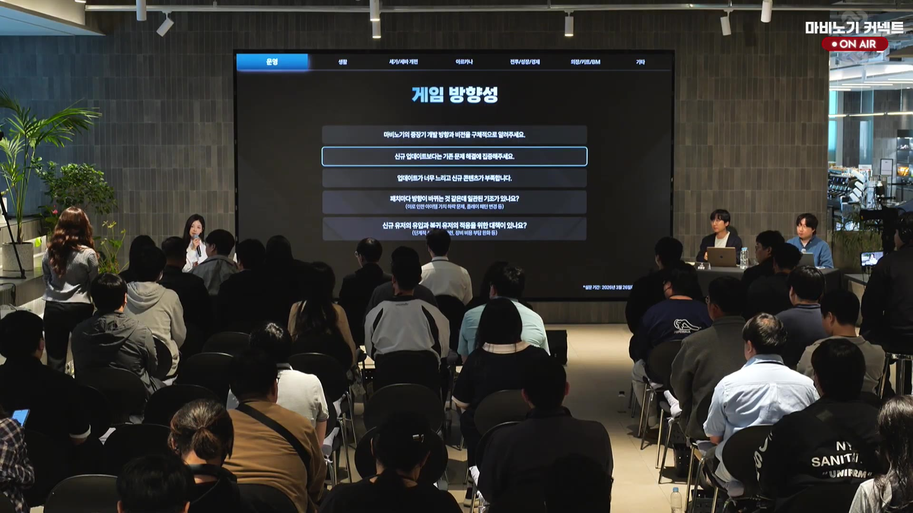 |
| 15:09:38~15:11:08 | 음성/Q&A | 질문 주제: 에르그 개방 방식 후속 의견 → 현장 의견: 기존 재료에 골드를 추가하거나 신광조 대체로 골드를 넣는 방식이 제안됨. 답변: 하시딤 자체 완화보다 다른 트랙으로 자연스럽게 에르그를 성장시키는 취지로 이해했으며, 내부 고민 사안이므로 후자 방향을 준비해보겠다고 답변 | `transcripts/chunk_000093.txt`~`transcripts/chunk_000095.txt` |
| 15:11:08~15:13:08 | 음성/Q&A | 질문 주제: 하시딤 미션 정석 공략의 파티 강제와 소규모 서버 접근성 → 질문: 정석 공략은 최소 6~9인 정도가 필요하고, 류트 외 서버에서는 최소 인원 모집도 어려워 정석 클리어가 사실상 불가능한 수준이라고 지적. 제안: 최소 인원을 3명 정도로 낮추면 접근성이 좋아질 것이라고 설명 | `transcripts/chunk_000096.txt`~`transcripts/chunk_000099.txt` |
| 15:13:08~15:15:38 | 음성/Q&A | 질문 주제: 멜로디 퍼피티어 이후 무의미해진 에르그/핸들/개조/정령 효과 → 질문: 인형술의 인형 생존·방어·자동방어 계열 추가 효과가 새 아르카나 구조에서 무의미해진 문제 개선 의향을 질의. 답변: 인형 조작감 해소를 우선 설계하며 해당 효과들이 제대로 의미를 갖지 못하는 상황을 인정했고, 무제한 화살처럼 노후화된 기능 전반과 함께 개선하는 것이 좋겠다고 설명 | `transcripts/chunk_000100.txt`~`transcripts/chunk_000104.txt` |
| 15:15:38~15:17:08 | 음성/Q&A | 질문 주제: 힐링 원드 에르그 추가에 따른 에르그 수요·가치 변화 대응 → 질문: 테스트 서버 내용이 본 서버에 적용되면 힐링 원드 에르그로 수요가 늘어나는 만큼 함께 개선이 들어올 수 있는지 질의. 답변: 가치 변화 의견은 이해했지만, 현재로서는 비용과 시간이 필요해 당장 계획에 없다고 답변 | `transcripts/chunk_000105.txt`~`transcripts/chunk_000107.txt` |
| 15:17:08~15:19:38 | 음성/Q&A | 질문 주제: 멜로디 퍼피티어 등 아르카나 이후 버려진 에르그 옵션의 구체적 개선 방향 → 질문: 하반기 개선을 언급한 노후/무의미 옵션을 어떤 구조로 바꿀지 질의. 답변: 현재 의미가 약한 효과를 다시 의미 있게 만드는 방향이며, 멜로디 퍼피티어 관점에서는 인형 방어보다 공격 능력이나 편의성 쪽으로 전환하는 것이 더 적절할 수 있다고 설명. 다만 즉흥적 방향 제시라 세부안은 확정 전이라고 한계를 밝혔다 | `transcripts/chunk_000108.txt`~`transcripts/chunk_000113.txt` |
| 15:19:38~15:24:38 | 음성/Q&A | 질문 주제: 종족별 특화/격차와 전투 참여 제한 문제 → 질문: 기존 문제 해결 차원에서 자이언트·엘프 등 종족 특화가 조준 속도, 스킬 쿨타임 등 지속적 논란을 낳으므로 외형만 특화하고 성능은 동일화하는 방안을 질의. 답변: 엘프는 궁술 무기를 극단까지 다루고 달리면서 스킬을 쓰는 장점, 자이언트는 근접전투/렌스 특화, 인간은 프레스 기반 다재다능과 모든 무기 활용 메리트로 종족별 장점을 유지하되 아르카나·종결 던전 등 핵심 전투는 종족 때문에 결정되지 않게 점진적으로 좁히겠다고 설명 | `transcripts/chunk_000123.txt`~`transcripts/chunk_000135.txt` |
| 15:24:38~15:29:38 | 음성/Q&A | 질문 주제: 아르카나 비중과 종족 간 박탈감 → 답변: 시대 변화와 커뮤니티 불만을 인지하지만 종족 고유 재미를 완전히 지우긴 어렵다고 설명. 다만 전투 참여/종결 콘텐츠 진입이 종족으로 좌우되어서는 안 된다는 원칙을 재확인 | `transcripts/chunk_000123.txt`~`transcripts/chunk_000135.txt` |
| 15:29:38~15:34:38 | 음성/Q&A | 질문 주제: 최근 서버 상태 악화와 원인 공유 요청 → 답변: 과거의 로그인/필드레이드 렉과 달리 지금은 콘텐츠 누적로 전반 부하가 올라가 임계점을 넘는 구조라고 설명. 서버 모니터링 시스템을 별도로 구축 중이며 작은 부하를 줄여 가는 방식으로 개선하겠다고 약속 | `transcripts/chunk_000136.txt`~`transcripts/chunk_000142.txt` |
| 15:34:38~15:38:38 | 음성/Q&A | 질문 주제: 반복 스킬 사용 편의와 외부 프로그램/DXVK·레지스트리 수정 허용 여부 → 답변: 키다운 같은 편의 지원은 빠르게 돕겠지만 외부 프로그램은 서비스 안정성 때문에 허용 불가. 레지스트리 수정은 컴퓨터 설정 변경에 가까운 비교적 안전한 방식이라 별도 제재는 하지 않는다고 설명 | `transcripts/chunk_000143.txt`~`transcripts/chunk_000152.txt` |
| 15:38:38~15:43:38 | 음성/Q&A | 질문 주제: 치명적 버그 재발과 느린 후속 대응 → 답변: 수정한 버그가 다른 루트로 재현되는 경우가 있어 재발하며, 브리레어 날씨 버그 등 추적 중인 사안은 최대한 빨리 고치겠다고 사과. 알려진 버그라도 진행 상황을 공지로 공유해 달라는 신뢰 개선 요청이 이어짐 | `transcripts/chunk_000153.txt`~`transcripts/chunk_000160.txt` |
| 15:43:38~15:46:38 | 음성/Q&A | 질문 주제: 1인 1계정인데도 보호모드가 걸리는 사례 → 답변: IP 하나에서 여러 계정 접속 시 차단되는 보호 조치이며, 오탐 여부는 로그인 기록을 다시 확인해 보겠다고 설명. 룸메이트/커뮤니티 사례도 있어 추가 검토를 약속 | `transcripts/chunk_000161.txt`~`transcripts/chunk_000164.txt` |
| 15:46:38~15:50:38 | 음성/Q&A | 질문 주제: 인간 알케믹 스팅어/석궁 변화로 인한 기존 장비 가치 하락과 보상 요구 → 답변: 인간의 석궁 메리트는 의도된 차별화이고, 활에 투자한 기존 아이템의 가치 하락을 모든 경우에 보상해 주는 안전장치는 현실적으로 어렵다고 설명 | `transcripts/chunk_000165.txt`~`transcripts/chunk_000175.txt` |
| 15:50:38~15:56:38 | 음성/Q&A | 질문 주제: 다계정·다컴 운영의 공식 정의와 제재 방식 → 답변: 한 순간에 한 캐릭터에만 몰입하는 것이 기준이며, 다계정 여부와 부정 이용은 로그로 폭넓게 조사한다고 설명. 공개 가능한 세부 로그는 방어 회피를 막기 위해 제한되며, 다계정/배럭 구조는 이번 여름 개선과 더 공정한 플레이 방향으로 이어가겠다고 밝혔다 | `transcripts/chunk_000176.txt`~`transcripts/chunk_000195.txt` |
| 15:56:38~16:04:08 | 음성/Q&A | 질문 주제: 다클라를 유발하는 보상 구조와 브리레어식 보상 도입 여부 → 질문: 낮은 보상 확률이 다클라/다컴을 관습화시켰다는 지적, 브리레어 보상 시스템이 해소책인지와 기존 던전에도 도입할지 질의. 답변: 울라·몽라·크롬·글렌·브리레어 등 각 던전의 보상 구조를 어떻게 둘지 아직 결론이 없고, 개인/공통/주사위식 보상을 비교 중이라고 설명. 보완책: 기본 골드 보상과 더 낮은 단계의 보상상자 추가를 검토. 후속: 유저는 최종 방향을 정하고 설득하는 책임을 운영 측이 져야 한다고 지적 | `transcripts/chunk_000196.txt`~`transcripts/chunk_000210.txt` |

| 16:06~16:10 | 음성/Q&A | 동일 사양 아이템이 거래 가능/불가, 이름 차이 등으로 분리된 문제를 일괄 정리해 여름 업데이트 핵심 개선으로 추진하겠다고 설명 | `transcripts/chunk_000214.txt`~`transcripts/chunk_000219.txt` |
| 16:10~16:13 | 음성/Q&A | 펫 수가 많을수록 로그인 렉이 생겨 상한 확대가 어렵고, 별도 보관·검색 방식 개선을 검토하겠다고 설명 | `transcripts/chunk_000220.txt`~`transcripts/chunk_000224.txt` |
| 16:13~16:16 | 음성/Q&A | 브리레어 저인팟 보상은 정당한 노력으로 보고 구조를 유지하겠다고 답했고, 추가 제안은 정리 후 설명하겠다고 밝혔다 | `transcripts/chunk_000224.txt`~`transcripts/chunk_000228.txt` |
| 16:16~16:20 | 음성/Q&A | 캐릭터 생성순 정렬과 은행/펫 내 아이템 탐색 불편을 지적받아, 캐릭터 순서 정렬·목록화·검색 기능을 검토하겠다고 답했다 | `transcripts/chunk_000229.txt`~`transcripts/chunk_000235.txt` |
| 16:20~16:25 | 음성/Q&A | 낭만 농장·달빛섬·탈농 같은 기존 콘텐츠 통합은 기술/기획/설치물 회수 우려 때문에 어렵다고 설명했다 | `transcripts/chunk_000236.txt`~`transcripts/chunk_000241.txt` |
| 16:25~16:26 | 음성/Q&A | 휴식시간에 대주제/소주제 프린트물을 제공해 달라는 요청에 준비하겠다고 답했다 | `transcripts/chunk_000242.txt`~`transcripts/chunk_000243.txt` |
| 16:54~17:09 | 화면/음성 | 휴식 직전 대기 화면에서 카운트다운이 05:37→02:07로 줄었고, 음성으로는 메크로 계정 5개 추가 발견 및 즉시 제재, 오후 5시까지 휴식과 프린트물 준비를 공지했다. 이후 최신 화면은 디렉터 최동민이 다시 마이크를 잡은 ON AIR 패널 화면으로 전환됐다 | `transcripts/chunk_000244.txt`~`transcripts/chunk_000246.txt` `captures/frame_000909.jpg`  `captures/frame_000930.jpg`  `captures/frame_000998.jpg` 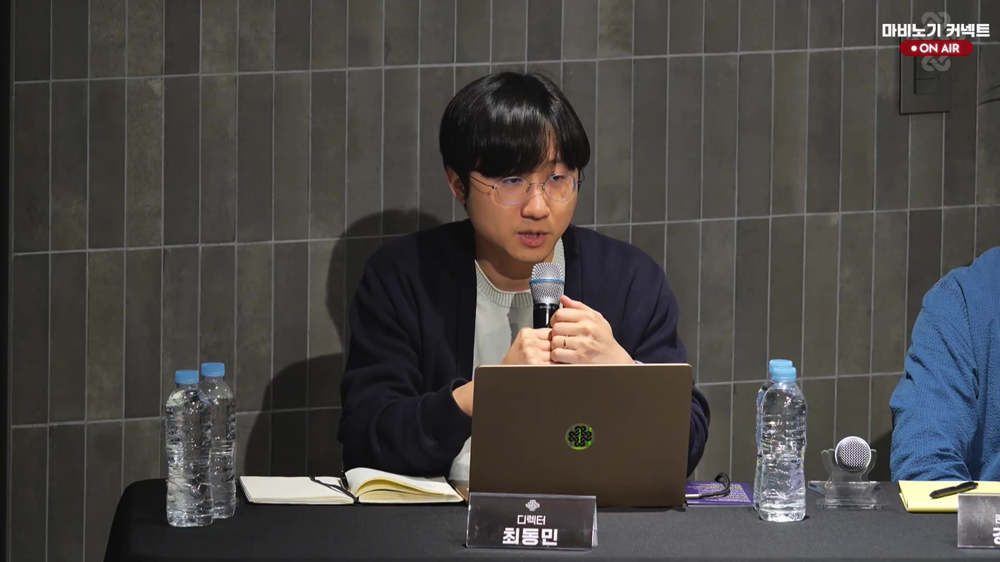 |
| 17:15~17:26 | 화면 | 객석 참가자가 무선 마이크로 질문/의견을 말하는 장면이 포착됐고, 라이브 오버레이는 계속 유지됐다. 해당 구간 STT가 비어 있어 세부 발언은 확인되지 않음 | `captures/frame_001038.jpg` 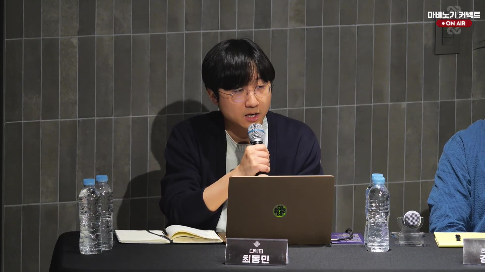 |
| 17:26~17:35 | 화면 | 후반부 객석 질의응답이 이어져 다른 참석자가 손마이크를 들고 발언하는 장면이 확인됐다. 별도 슬라이드/명패는 없고, 세부 발언은 STT 공백으로 확인 불가 | `captures/frame_001151.jpg` 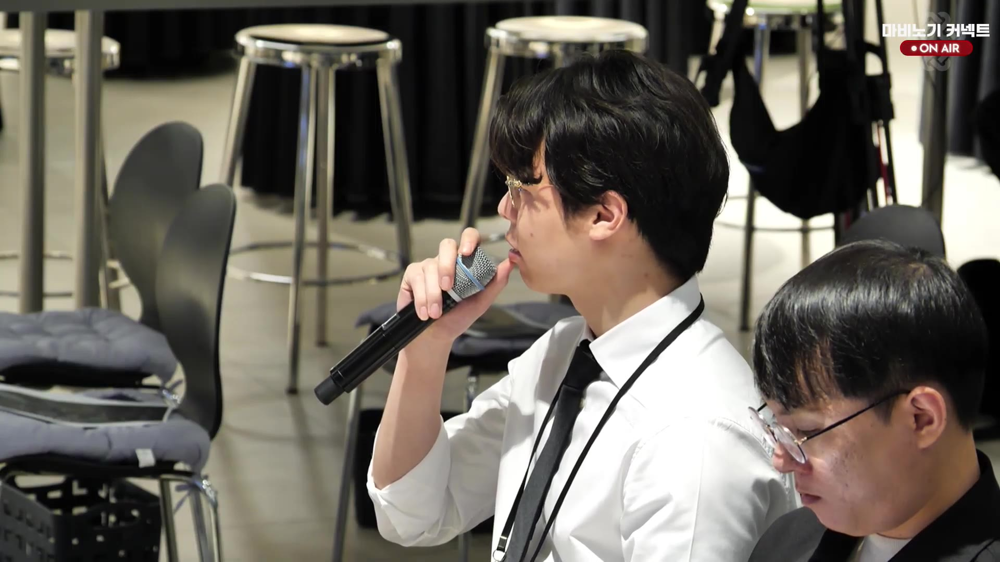 |
| 17:35~17:41 | 화면 | 후반부에는 다시 패널석 클로즈업으로 돌아와 디렉터 최동민이 마이크를 든 채 발언 중이었고, 우상단 ON AIR 표시와 명패가 유지됐다 | `captures/frame_001171.jpg` 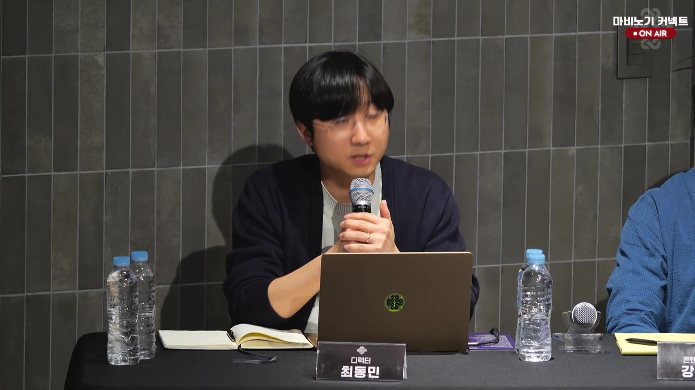 |
| 17:55~17:56 | 화면/문서 | "게임 방향성" 운영 탭 슬라이드가 다시 확대되어 솔로 플레이 유저 패치, 재미 개선, 유저 감소 위기감, 시골 서버 인구 부족/서버 통합 계획 질문이 표시됨. 우측 하단에 설문 기간(2026년 3월 26일~4월 5일)이 보임 | `captures/frame_001274.jpg` 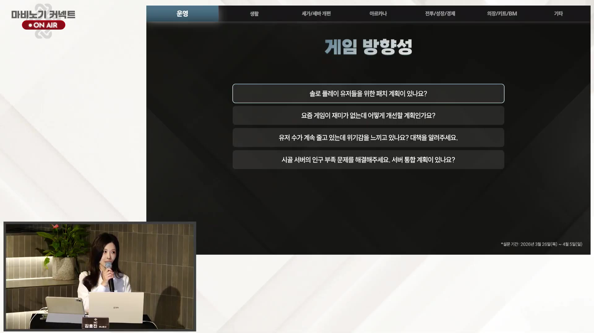 |
| 18:06~18:10 | 음성/Q&A | 질문 주제: 브리레 대비 보상감과 던전 성장 목표, 크롬바스 시면·고리아스 설계 → 답변: 브리레/위드맥 균열 이하 구간은 보상감이 낮아 성장 목표를 크롬바스 시면 등으로 보강하겠다고 설명. 크롬바스 시면은 미듬의 균열과 유사한 수준의 4인 던전, 고리아스는 브리레 이후 콘텐츠지만 글램베른→크롬바스 정도의 완만한 난이도 차이를 목표로 한다고 답했다 | `transcripts/chunk_000446.txt`~`transcripts/chunk_000453.txt` |
| 18:10~18:11 | 음성/Q&A | 질문 주제: 시즌별 이벤트·키트 주기와 기대감 저하 → 답변: 두근두근 아일랜드·올밍 키트처럼 시즌마다 기대하던 사이클이 흔들리고 있다는 지적이 나왔고, 현재 전사 범위에서는 답변이 확인되지 않았다 | `transcripts/chunk_000454.txt`~`transcripts/chunk_000455.txt` |
| 18:11~18:12 | 화면 | 객석 질의응답 중 우상단 오버레이가 "매머드커피랩 ON AIR"로 보이는 최신 현장 화면이 확인됐다 | `captures/frame_001370.jpg` 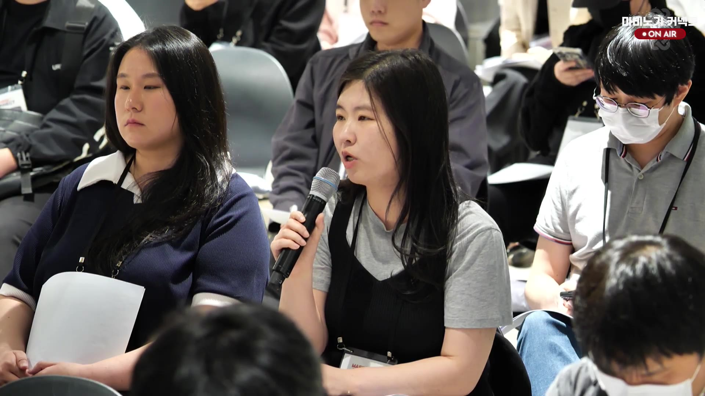 |
| 18:14~18:15 | 음성/Q&A | 질문 주제: 신규 이벤트·새 콘텐츠 도입과 기대감 회복 → 답변: 기존 콘텐츠 개선에 집중하는 동안 상반기에는 새로운 이벤트를 적극적으로 선보이기 어렵지만, 계속 고민하고 선보이기 위해 노력하겠다고 답했다 | `transcripts/chunk_000462.txt`~`transcripts/chunk_000465.txt` |
| 18:15~18:18 | 음성/Q&A | 질문 주제: 브리레 던전의 반복성·불쾌감과 개선 방향 → 답변: 무의미한 반복 스킬과 강제 이동처럼 플레이어가 통제할 수 없는 불쾌한 요소는 고쳐야 하며, 불쾌감과 난이도는 구분해야 한다고 설명했다 | `transcripts/chunk_000466.txt`~`transcripts/chunk_000471.txt` |
| 18:17~18:18 | 화면 | 객석 질의응답 중 우상단 오버레이가 "마비노기 커넥트 ON AIR"로 다시 보이는 최신 현장 화면이 확인됐다 | `captures/frame_001407.jpg` 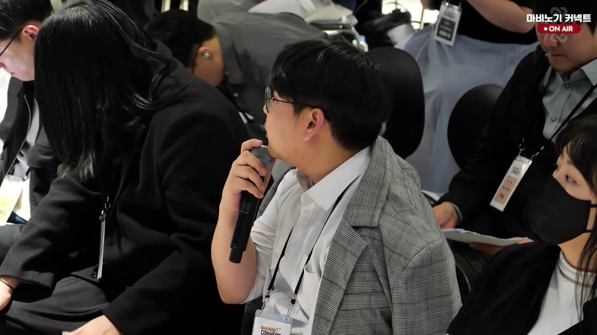 |
| 18:18~18:20 | 음성/Q&A | 질문 주제: 브리레 던전의 장시간 구간·운 요소·파티 전멸 압박과 고리아스 설계 → 답변: 핵심 재미를 드릴 수 있는 패턴을 더 짧고 밀도 있게 구성하고, 운으로 대처하는 패턴은 자제하겠다고 설명. 고리아스에서는 실수로 인한 파티 전멸보다 개인 죽음으로 귀결되도록 하여 불쾌감을 줄이겠다고 답했다 | `transcripts/chunk_000472.txt`~`transcripts/chunk_000476.txt` |
| 18:20~18:22 | 음성/Q&A | 질문 주제: 브리레 50% 구간의 전조 없는 기믹과 유령패드 같은 랜덤성 제어 → 답변: 운보다 실력으로 극복할 수 있도록, 랜덤 요소를 줄인 패치를 지향하겠다고 답했다 | `transcripts/chunk_000477.txt`~`transcripts/chunk_000479.txt` |
| 18:22~18:25 | 음성/Q&A | 질문 주제: 딜캡의 필요성과 하위 던전에서의 불쾌감 → 답변: 딜캡은 상위 난이도에선 필요하지만 하위 던전에서는 원래 한방에 잡을 몬스터가 막혀 시간만 늘어나므로, 하위 던전은 딜로 스킵 가능한 방향으로 조정하겠다고 설명했다 | `transcripts/chunk_000481.txt`~`transcripts/chunk_000483.txt` |
| 18:25~18:27 | 음성/Q&A | 질문 주제: 유저 수 감소 위기감과 대책 → 답변: 위기감과 책임감을 느끼고 있으며, 마비노기를 다시 즐거운 게임으로 만들어 친구 초대와 복귀를 유도하겠다고 답했다 | `transcripts/chunk_000484.txt`~`transcripts/chunk_000486.txt` |
| 18:27~18:28 | 음성/Q&A | 질문 주제: 시골 서버 인구 부족 문제와 서버 통합 계획 → 답변: 서버 통합 의견은 인지하고 있으나 기술적 문제가 크고, 현재도 류트 서버 렉과 DB 부하가 있어 어렵다고 설명했다 | `transcripts/chunk_000487.txt`~`transcripts/chunk_000488.txt` |
| 18:38 | 화면 | 방송 말미에 MC 김효진 아나운서가 진행하는 ON AIR 화면으로 전환되어 새로운 진행자 명패가 확인됨 | `captures/frame_001535.jpg`  |
| 18:40 | 화면 | 최신 화면에서는 다시 디렉터 최동민 명패가 보이는 ON AIR 패널 장면으로 돌아옴 | `captures/frame_001548.jpg` 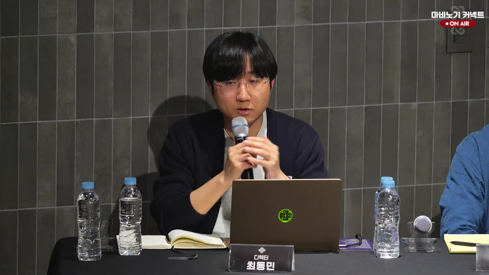 |

## Q&A 주제별 정리

| 주제 | 질문/문제 제기 | 답변/약속 | 근거 |
|---|---|---|---|
| 개발·QA 검증 부족 | 테스트/정식 서버 반영 전 버그와 기획 문제가 충분히 걸러지지 않았다는 지적 | 개발 프로세스 재편, 사전 안내, 정식 서버 반영 일정 재조정 절차 적용. QA는 국내 인력 중심+해외 인력 보조 구조라고 설명 | `transcripts/chunk_000000.txt`~`transcripts/chunk_000011.txt` |
| 테스트 서버 환경 | 본 서버와 다른 캐릭터 상태, 반복 세팅, 테스트 불가 기간, 핫픽스 지연 문제 | 본 서버 캐릭터 환경에 가깝게 테스트 서버를 준비하고 반복 작업을 줄이겠다고 답변. 세바/세이크리드 가드 테스트 이슈는 더 빠르게 대응 | `transcripts/chunk_000012.txt`~`transcripts/chunk_000023.txt` |
| 세인트 바드 장막 조정 | 테스트 서버에서 검증이 필요한데 정식 서버 반영 일정이 빠르다는 우려 | 다음 주 정식 서버 반영을 미루고 테스트 서버를 연장해 장막 조정 안정성을 검증하겠다고 설명 | `transcripts/chunk_000020.txt`~`transcripts/chunk_000022.txt` |
| 기존 전투 문제 | 엘레멘탈 나이트 스매시, 블래스트 랜서 위치렉, 다크메이지 인챈트 가치 문제 | 스매시는 전체 수정 대신 엘레멘탈 나이트/아르카나 링크 보너스 등 제한적 개선을 검토. 세이크리드 가드 형평성도 함께 고려. 랜스 차지 위치렉은 재개선 검토 | `transcripts/chunk_000024.txt`~`transcripts/chunk_000037.txt` |
| 세공·효과 표기 | 낚시대 물고기 크기 세공, 보호파괴 한돌 효율, 효과 표기 부족 | 물고기 크기 세공은 재확인. 세공·품질·스킬 효과 표기 부족은 하반기 개선 약속과 연결해 설명 | `transcripts/chunk_000038.txt`~`transcripts/chunk_000047.txt` |
| 확률 표기·고지 누락 | 세공 가이드 고지 누락, 확률표 안내 부족, 추가 위법 사안 미공지 문제 | 세공 옵션 중첩 미등장 고지 누락은 휴먼 에러로 설명하고 수정 완료. 세공 도구 구매 과정 확률표 안내 부족은 추가 안내 필요 사안으로 설명 | `transcripts/chunk_000048.txt`~`transcripts/chunk_000056.txt` |
| 기존 문제 해결 우선순위 | 서버렉, 밸런스, 다계정/매크로, UI, 불편 버그 방치 인식 | 주간 도달 던전 그래프를 근거로 하위/성장 구간 이탈을 최우선으로 보고, 서버렉·다계정·밸런스도 병행 개선 | `transcripts/chunk_000057.txt`~`transcripts/chunk_000068.txt`, `captures/frame_000226.jpg`  |
| 데이터 해석 | 그래프 절대값 여부, 다계정 포함 여부, 프리시즌 비교 한계 | 절대값이고 다계정 포함. 내부적으로 더 긴 기간 데이터를 보며, 신규/복귀 유저 정착 실패 영향이 더 크다고 설명 | `transcripts/chunk_000069.txt`~`transcripts/chunk_000075.txt` |
| 신규 유저 정보 접근성 | 퀘스트·아이템 정보를 게임 내에서 찾기 어렵고 던전 가이드/스마트 콘텐츠가 부족 | 퀘스트 자동 길찾기와 정보 안내 공간 확대를 시도했지만 여전히 부족하다고 인정하고, 지적된 부분부터 개선하겠다고 답변 | `transcripts/chunk_000076.txt`~`transcripts/chunk_000079.txt` |
| 에르그 재료·하시딤 접근성 | 힐링 원드 에르그 개방 재료 중 하시딤 미션 의존도가 높은 재료의 접근성이 낮고, 대체 공급처도 일시적이거나 이용률이 낮다는 지적 | 하시딤 미션 대폭 완화 또는 주요 콘텐츠/성장 과정으로 재료 지급처 확장이라는 두 방향을 검토 중이나 결론은 미정. 현장 의견을 추가로 요청 | `transcripts/chunk_000080.txt`~`transcripts/chunk_000087.txt` |
| 에르그 개방 방식 후속 의견 | 에르그가 기본 성장 요소가 되었는데 신규 유저는 재료를 자연스럽게 얻기 어렵고 기존 유저가 미션을 덜 돌면 공급 악순환이 생긴다는 지적 | 참석자가 골드로 에르그를 개방하는 등 재료 의존을 낮추는 방식을 제안했고, 개발 측은 하시딤 자체 완화보다 자연스러운 별도 성장 트랙·재료 의존 완화 방향을 준비하겠다고 답변했다 | `transcripts/chunk_000088.txt`~`transcripts/chunk_000095.txt` |
| 에르그 개방 방식·하시딤 접근성 후속 | 골드 개방/신광조 대체, 소규모 서버의 하시딤 최소 인원 모집 문제, 3인 수준 완화 제안 | 하시딤 자체 완화보다 자연스러운 별도 성장 트랙·재료 의존 완화 방향을 준비하겠다고 답변. 소규모 서버 접근성도 함께 고려하겠다고 설명 | `transcripts/chunk_000093.txt`~`transcripts/chunk_000099.txt` |
| 노후화된 에르그/장비 효과 | 멜로디 퍼피티어 때문에 인형 생존력·방어·부활 등 기존 인형술 관련 효과가 무의미해졌다는 지적 | 해당 문제를 인정하고, 무제한 화살처럼 시간이 지나 의미가 약해진 기능 전반과 함께 하반기 중 개선을 준비하겠다고 답변 | `transcripts/chunk_000100.txt`~`transcripts/chunk_000104.txt` |
| 힐링 원드 에르그 수요 증가 | 본 서버 적용 시 힐링 원드 에르그 추가로 에르그 수요·가치 변화가 생기므로 함께 개선 가능한지 질의 | 현재로서는 비용과 시간이 필요해 당장 계획에 없다고 답변 | `transcripts/chunk_000105.txt`~`transcripts/chunk_000107.txt` |

| 버려진 에르그 옵션의 개선 방향 | 멜로디 퍼피티어 등 새 아르카나 이후 쓰이지 않는 에르그 옵션을 하반기에 어떤 구조로 개선할지 질의 | 의미 없는 효과를 다시 의미 있게 바꾸는 방향이며, 멜로디 퍼피티어 기준으로 인형 방어보다 공격 능력·편의성 쪽 전환이 적절할 수 있다고 설명. 단, 즉흥적 예시라 확정안은 아님 | `transcripts/chunk_000108.txt`~`transcripts/chunk_000113.txt` |
| 종족 특화와 성능 동일화 | 종족별 특화가 조준 속도·스킬 쿨타임 등 논란을 계속 만들기 때문에 외형만 특화하고 성능을 동일화할 수 있는지 질의 | 종족의 특별함에서 오는 선택/재미와 종족별 인구 격차를 고려해 특화를 유지해 왔다고 설명. 다만 종족 때문에 전투 참여나 종결 던전 진입이 결정되어서는 안 되므로 필수 전투 영역의 차이는 점진적으로 좁혀 왔다고 답변 | `transcripts/chunk_000123.txt`~`transcripts/chunk_000135.txt` |

| 서버 상태 악화와 원인 설명 | 과거의 로그인/필드레이드 렉과 달리 지금은 콘텐츠 누적로 전반 부하가 올라가 임계점을 넘는 구조라는 설명 | 서버 모니터링 시스템을 별도 구축 중이며 작은 부하를 줄여 가는 방식으로 개선하겠다고 약속 | `transcripts/chunk_000136.txt`~`transcripts/chunk_000142.txt` |
| 외부 프로그램과 레지스트리 수정 | 키다운 같은 편의 지원과 외부 프로그램/DXVK, 레지스트리 수정 허용 여부 질문 | 외부 프로그램은 서비스 안정성 때문에 허용 불가, 레지스트리 수정은 비교적 안전한 설정 변경이라 별도 제재하지 않는다고 설명 | `transcripts/chunk_000143.txt`~`transcripts/chunk_000152.txt` |
| 버그 재발과 공지 요청 | 같은 버그가 다른 루트로 재현되고 후속 대응이 느리다는 지적 | 추적 중인 사안은 최대한 빨리 고치겠다고 사과했고, 진행 상황을 공지로 공유해 달라는 신뢰 개선 요청이 이어짐 | `transcripts/chunk_000153.txt`~`transcripts/chunk_000160.txt` |
| 보호모드 오탐 가능성 | 1인 1계정인데도 보호모드가 걸린다는 사례 | IP 하나에서 여러 계정 접속 시 차단되는 보호 조치이며, 로그인 기록 재확인과 추가 검토를 약속 | `transcripts/chunk_000161.txt`~`transcripts/chunk_000164.txt` |
| 인간 석궁 변화와 보상 한계 | 활에 투자한 기존 장비가 석궁 메리트 변경으로 가치 하락을 겪는다는 지적 | 인간의 석궁 메리트는 의도된 차별화이며, 모든 경우의 보상 안전장치는 현실적으로 어렵다고 설명 | `transcripts/chunk_000165.txt`~`transcripts/chunk_000175.txt` |
| 다계정·다컴 정책 | 다계정·다컴 운영의 공식 정의와 제재 방식 질문 | 한 순간에 한 캐릭터에만 몰입하는 것이 기준이며, 로그로 폭넓게 조사하되 세부는 공개 제한. 이번 회차에서 메크로 계정 5개를 추가 발견해 즉시 제재했다고 공지 | `transcripts/chunk_000176.txt`~`transcripts/chunk_000195.txt`, `transcripts/chunk_000245.txt` |
| 다클라 유발 보상 구조 | 낮은 보상 확률이 다클라를 관습화시켰고, 브리레어식 보상이 대안인지 질의 | 브리레어 포함 여러 던전의 보상 구조를 아직 결론 내리지 못했으며, 개인/공통/주사위식 보상과 기본 골드 보상, 낮은 단계 보상상자 추가를 검토 중이라고 답변. 후반부에는 운영이 최종 방향을 정하고 유저를 설득해야 한다는 요구가 재차 나왔고, 개발 측은 추가 정리 후 설명하겠다고 밝혔다 | `transcripts/chunk_000196.txt`~`transcripts/chunk_000213.txt` |
| 게임 방향성 운영 탭 질문 목록 | 화면에서 솔로 플레이 유저 패치, 재미 개선, 유저 감소 위기감, 시골 서버 인구 부족/서버 통합 계획 질문이 확인됨. 아직 답변 전인 슬라이드 문항이라 후속 Q&A를 지켜봐야 함 | `captures/frame_001274.jpg`  |
| 던전 성장 보상·크롬바스 시면·고리아스 | 브리레 대비 보상감이 낮고 새 던전의 성장 목표가 부족한데, 크롬바스 시면과 고리아스는 어떻게 배치되는가 | 브리레·위드맥 균열 이하 구간의 보상감을 보강하기 위해 크롬바스 시면 같은 성장 목표를 먼저 채우겠다고 답변. 크롬바스 시면은 미듬의 균열과 유사한 4인 던전으로 기획 중이며, 고리아스는 브리레 이후 콘텐츠지만 급격한 난이도 점프보다는 글램베른→크롬바스 수준의 완만한 차이를 목표로 한다고 설명 | `transcripts/chunk_000446.txt`~`transcripts/chunk_000453.txt` |
| 시즌 이벤트·키트 주기 | 두근두근 아일랜드, 올밍 키트 등 시즌별 기대 사이클이 깨져 재미 기대감이 줄었다는 지적 | 현재 전사 범위에서는 답변이 확인되지 않았다 | `transcripts/chunk_000454.txt`~`transcripts/chunk_000455.txt` |
| 신규 이벤트·새 콘텐츠 | 두근두근 아일랜드, 이리아 탐험대 같은 새 이벤트를 더 자주 선보일 수 없는지와 재미 회복 방안 질문 | 상반기 중에는 기존 콘텐츠 개선에 집중하느라 새로운 이벤트를 적극적으로 내기 어렵지만, 계속 고민해 선보이려 노력하겠다고 답했다 | `transcripts/chunk_000462.txt`~`transcripts/chunk_000465.txt` |
| 브리레 던전의 불쾌감과 난이도 | 반복 스킬과 강제 이동 같은 요소가 어려움보다 불쾌감으로 느껴진다는 지적 | 무의미한 반복과 통제 불가능한 강제 요소는 고쳐야 하며, 불쾌감과 난이도는 구분해야 한다고 설명했다 | `transcripts/chunk_000466.txt`~`transcripts/chunk_000471.txt` |
| 브리레 던전 후속 불쾌감 완화 | 장시간 구간, 운으로 대처하는 패턴, 파티 전멸 압박 등 추가 지적 | 고리아스에서는 핵심 재미를 짧고 밀도 있게 구성하고, 운 요소를 줄이며, 실수는 파티 전멸보다 개인 죽음으로 이어지게 하겠다고 답했다 | `transcripts/chunk_000472.txt`~`transcripts/chunk_000476.txt` |
| 브리레 50% 구간 랜덤 기믹 | 50% 전후 전조 없는 기믹과 유령패드 같은 랜덤성 제어가 불편하다는 지적 | 운보다는 실력으로 극복할 수 있도록, 랜덤 요소를 줄인 패치를 지향하겠다고 답했다 | `transcripts/chunk_000477.txt`~`transcripts/chunk_000479.txt` |
| 딜캡의 하위 던전 불쾌감 | 딜캡은 상위 난이도에선 필요하지만 하위 던전에서는 한방 처리가 막혀 시간만 늘어나는 불쾌감이 있다는 지적 | 하위 던전은 딜로 스킵 가능한 형태로 조정하겠다고 답했다 | `transcripts/chunk_000481.txt`~`transcripts/chunk_000483.txt` |
| 유저 감소 위기감과 대책 | 유저 수가 계속 줄고 있는데 위기감을 느끼는지, 어떤 대책이 있는지 질문 | 위기감과 책임감을 느끼고 있으며, 마비노기를 다시 즐거운 게임으로 만들어 친구 초대와 복귀를 유도하겠다고 답했다 | `transcripts/chunk_000484.txt`~`transcripts/chunk_000486.txt` |
| 시골 서버 인구 부족·서버 통합 | 서버 통합 계획이 있는지 질문 | 기술적 문제가 크고 현재도 류트 서버 렉과 DB 부하가 있어 통합은 어렵다고 설명했다 | `transcripts/chunk_000487.txt`~`transcripts/chunk_000488.txt` |
| 동일 사양 아이템 통합 | 거래 가능/불가, 이름 차이로 같은 아이템이 분리되어 불편하다는 지적 | 동일 사양 아이템을 일괄 정리하고 여름 업데이트 핵심 개선으로 반영하겠다고 답변 | `transcripts/chunk_000214.txt`~`transcripts/chunk_000219.txt` |
| 펫 상한과 보관/검색 | 펫 수가 많을수록 로그인 렉과 관리 불편이 커져 상한 확대가 어렵다는 지적 | 현재 서버 상태에서는 확장이 어렵지만, 별도 보관·검색 방식과 정리 개선을 검토하겠다고 설명 | `transcripts/chunk_000220.txt`~`transcripts/chunk_000224.txt` |
| 브리레어 저인팟 보상 | 저인팟/고투자 파티에 대한 보상도 고려해야 한다는 의견 | 정당한 노력으로 보고 구조를 유지한다고 답했고, 추가 제안은 더 정리해 설명하겠다고 밝혔다 | `transcripts/chunk_000224.txt`~`transcripts/chunk_000228.txt` |
| 캐릭터/은행 탭 정렬과 아이템 탐색 | 120개 수준의 캐릭터·펫·은행 탭에서 특정 아이템을 찾기 어렵고 순서 정렬도 불편하다는 지적 | 캐릭터 순서는 생성순 기반으로 보이며 예외를 확인해 보겠고, 정렬·목록화·검색 기능을 준비하겠다고 답변 | `transcripts/chunk_000229.txt`~`transcripts/chunk_000235.txt` |
| 레거시 콘텐츠 통합 한계 | 낭만 농장, 달빛섬, 탈농장처럼 기존 콘텐츠를 통합하거나 대체하는 방식이 잦다는 질문 | 기술적 복잡도와 설치물 회수 같은 기획 이슈 때문에 통합이 쉽지 않다고 설명 | `transcripts/chunk_000236.txt`~`transcripts/chunk_000241.txt` |
| 휴식시간 자료 제공 | 대주제/소주제 프린트물을 미리 제공해 달라는 요청 | 준비해 보겠다고 답변 | `transcripts/chunk_000242.txt`~`transcripts/chunk_000243.txt` |

## 음성 전사 요약

- 전체 흐름은 “문제 제기 → 인정/한계 설명 → 개선 약속 또는 추후 확인” 구조로 진행됐다.
- 개발·QA 관련 답변은 검증 부족을 인정하고, 개발 프로세스 재편·사전 안내·정식 서버 반영 일정 조정으로 이어졌다.
- 테스트 서버 관련 답변은 본 서버와 유사한 캐릭터 환경 제공, 반복 세팅 완화, 테스트 기간 연장/핫픽스 개선으로 정리된다.
- 전투/아르카나 관련 답변은 즉시 전면 수정이 어려운 구조적 한계를 설명하면서, 엘레멘탈 나이트 스매시 개선·세이크리드 가드 형평성 고려·랜스 차지 위치렉 재검토를 언급했다.
- 세공/확률 표기 관련 답변은 유저가 직접 실험해야 하는 정보 부족을 인정하고, 재확인·하반기 표기 개선·가이드/확률표 안내 보완으로 이어졌다.
- 기존 문제 해결 우선순위 답변은 주간 도달 던전 그래프를 근거로 신규/복귀 및 성장 구간 이탈을 핵심 문제로 보며, 서버렉·다계정/매크로는 별도 모니터링과 로그 기반 조치가 필요하다고 설명했다.
- 신규 유저 정보 접근성 답변은 게임 내 안내 시도에도 누적 정보 제공이 부족하다는 인정과 개선 약속으로 마무리됐다.
- 에르그 재료/하시딤 접근성 답변은 미션 완화와 재료 지급처 확장이라는 두 검토안을 제시했지만, 어느 방향이 정답인지는 미정이라고 설명했다.
- 후속 현장 의견으로 에르그 재료 수급 악순환을 줄이기 위해 골드 개방 등 대체 성장 방식을 추가하자는 제안이 나왔다.
- 에르그 후속 논의는 재료 수급을 기존 하시딤 완화에만 묶기보다 골드 활용이나 별도 성장 트랙을 통해 자연스럽게 성장시키는 방향으로 모였다.
- 하시딤은 소규모 서버에서 6~9인 정석 공략 인원 모집이 어렵다는 접근성 문제가 새로 제기됐다.
- 멜로디 퍼피티어 도입으로 무의미해진 인형 생존 관련 효과는, 노후화된 장비/정령 기능 전반 개선 과제로 묶여 하반기 개선 후보로 언급됐다.
- 이번 런에서는 446~455 구간 새 전사가 생성되어 브리레 대비 던전 보상감, 크롬바스 시면·고리아스 설계, 시즌 이벤트/키트 주기 불안이 추가로 확인됐다.

- 버려진 에르그 옵션의 구체적 개선 방향은 확정안이 아니라 원칙 수준으로 답변됐으며, 멜로디 퍼피티어 기준으로 방어보다 공격·편의성 효과 전환 가능성이 언급됐다.
- 종족 특화 논의에서는 “특별함”의 선택/재미를 유지하려는 이유와, 종족 때문에 핵심 전투 참여가 제한되면 안 된다는 원칙이 함께 제시됐다.
- 후반부에는 다클라를 유발하는 보상 구조를 두고 브리레어식 공통 보상, 개인 보상, 기본 골드 보상, 낮은 보상상자 추가 가능성을 비교했으나 아직 결론이 없다고 정리됐다.
- 유저는 실패한 업데이트의 원인이 설득 부족이라며, 최종 방향을 운영 측이 정하고 설명해야 한다고 강하게 요구했다.
- 마무리 공지에서 메크로 계정 5개가 추가 발견돼 즉시 제재됐고, 오후 5시까지 휴식하며 프린트물과 진행 순서를 준비하겠다고 알렸다.

- 유저 수 감소 위기감에 대해서는 책임감을 느끼고 있고, 마비노기를 다시 즐거운 게임으로 만들어 친구 초대와 복귀를 유도하겠다고 답했다. 서버 통합은 류트 서버 렉/DB 부하 때문에 현재 어렵다고 설명했다.

## 주요 화면 캡처

### 2026 주간 도달 던전 그래프

### ON AIR / 디렉터 최동민

### ON AIR 발언 장면 지속

### 콘텐츠 리더 강민석 발언 장면

### 게임 방향성 / 운영 탭

### 코드 OCR 자동 감지 문서 후보 266

### 코드 OCR 자동 감지 문서 후보 346
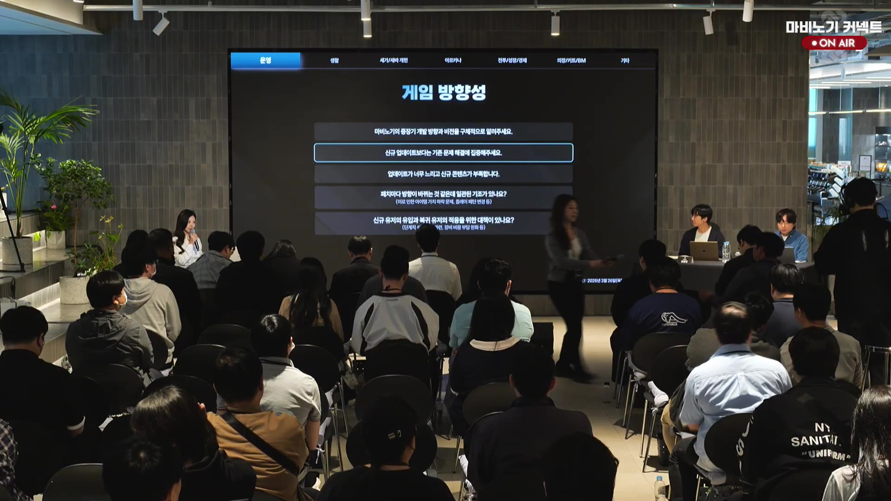

### 마비노기 커넥트 LIVE 대기 화면

방송 재개 전 대기 화면으로 보이며, 카운트다운과 시작 안내 문구가 표시됐다.

### 마비노기 커넥트 LIVE 대기 화면 02:07

방송 재개 직전 카운트다운이 줄어든 대기 화면으로 확인됐다.

### 디렉터 최동민 ON AIR 패널 복귀

휴식 후 다시 ON AIR로 돌아온 패널 화면으로, 디렉터 최동민이 계속 발언 중이었다.

### 객석 질문 장면

객석 참가자가 마이크로 질문/의견을 말하는 장면이 포착됐지만, STT는 비어 있어 세부 내용은 확인되지 않았다.

### 후반부 객석 질의응답 지속

다른 참석자가 손마이크를 들고 발언하는 후반부 객석 Q&A 장면으로, 별도 슬라이드나 명패는 보이지 않았다.

### 게임 방향성 운영 탭 질문 목록

운영 탭에서 솔로 플레이, 재미 개선, 유저 감소 위기감, 시골 서버 인구 부족/서버 통합 관련 질문이 다시 확대되어 보였다.

### 매머드커피랩 ON AIR 객석 질의응답

객석 질의응답이 이어지는 최신 현장 화면으로, 우상단 오버레이에 매머드커피랩 ON AIR가 보였다.

### 마비노기 커넥트 ON AIR 최신 객석 질의응답

객석에서 마이크를 든 발언자가 보이고, 우상단에 마비노기 커넥트 ON AIR가 다시 표시된 최신 화면이다.

### MC 김효진 아나운서 진행 화면

방송 말미에 새로운 진행자 명패와 함께 MC 김효진 아나운서가 마이크를 잡은 장면이다.

### 디렉터 최동민 패널 복귀 화면

최신 프레임에서는 다시 디렉터 최동민 명패가 보이는 패널 발언 장면으로 돌아왔다.

## 최종 정리

- 현재 라이브는 마비노기 커넥트 ON AIR 질의응답이며, 디렉터 최동민과 콘텐츠 리더 강민석 발언 장면이 확인됐다.
- 초반에는 개발/QA 검증 부족, 테스트 서버 환경 개선, 정식 서버 반영 일정 조정이 핵심이었다.
- 세인트 바드 장막 조정, 스매시/랜스/인챈트, 세공·확률 표기, 서버렉·다계정 정책 같은 운영·전투 이슈가 이어졌다.
- 기존 문제 해결 우선순위는 하위 던전 이용 감소와 신규/복귀 정착 실패로 요약됐다.
- 에르그/하시딤, 멜로디 퍼피티어, 종족 특화, 다클라 보상 구조, 동일 사양 아이템 정리, 펫/은행 편의 개선이 중후반 주요 주제였다.
- 17시대 후반 게임 방향성 슬라이드가 다시 잡혔고, 솔로 플레이·재미 개선·유저 감소·서버 통합 질문이 표시됐다.
- 18시대 새 음성에서는 브리레 대비 보상감, 크롬바스 시면(4인 던전), 고리아스의 완만한 난이도 설계가 추가로 논의됐다.
- 같은 시간대에 신규 이벤트·새 콘텐츠 도입의 현실적 어려움, 두근두근 아일랜드·올밍 키트처럼 기대하던 시즌 사이클의 흔들림이 제기됐다.
- 브리레 던전은 반복 스킬과 강제 이동, 50% 전후 전조 없는 기믹, 유령패드 같은 랜덤 요소, 파티 전멸 압박까지 불쾌 요소가 겹친다고 지적됐고, 고리아스는 운이 아닌 실력으로 커버하도록 개인 죽음 중심의 완화 방향을 제시했다.
- 딜캡은 상위 난이도에서는 필요하지만 하위 던전에서는 한방 처리가 막혀 시간만 늘어나는 불쾌감이 있어, 하위 던전은 딜로 스킵 가능한 형태로 조정하겠다고 답했다.
- 유저 수 감소 위기감에는 즐거운 게임으로 복귀를 유도하겠다고 답했고, 시골 서버 통합은 류트 서버 렉/DB 부하와 기술적 문제 때문에 어렵다고 설명했다.
- 중간에는 객석 질의응답 중 `마비노기 커넥트 ON AIR`와 `매머드커피랩 ON AIR`가 번갈아 확인됐고, 말미에는 MC 김효진 아나운서 진행 화면을 거쳐 다시 디렉터 최동민 패널 화면으로 돌아왔다.
- 메크로 계정 5개 추가 제재와 휴식 공지가 있었다.
