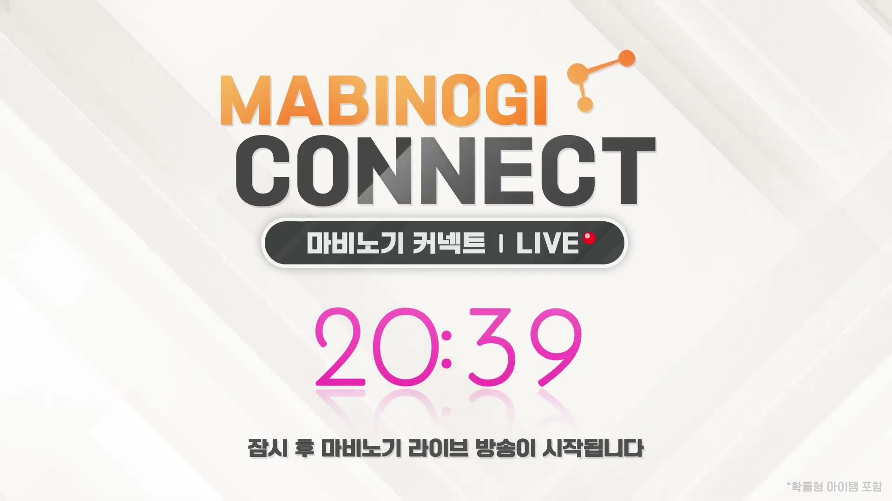

# YouTube Live 2부 실시간 요약

- URL: https://www.youtube.com/watch?v=lSX4UvPFIZM
- 시작: 2026-04-25 23:31:10 KST
- 상태: 진행 중
- 작업 경로: `videos/lSX4UvPFIZM/`

## 핵심 요약

- 2부 초반 질의응답은 명장/장인 시스템 구조와 생활 랭킹 경쟁 부담에 집중됐다.
- 명장 선발은 골드만이 아니라 시간도 함께 투입되도록 설계했으며, 협회 코인 시스템으로 골드만으로 무한정 점수를 올리기 어렵게 했다고 설명했다.
- 요리 명장에서는 앤티크 요리도구·세공 같은 기존 자산의 메리트가 여전히 커서 동일 출발선 취지와 어긋난다는 지적이 나왔고, 개발 측은 완전 배제는 어렵지만 다른 방식의 보완을 검토하겠다고 답했다.
- 서버별 인구/경제 차이 때문에 랭킹 경쟁 강도가 달라지는 불균형은 현재 구조상 일부 불가피하다고 설명했다.
- 특별 상점 이용과 명장 심사 코인을 같은 재화로 묶은 것은 이용자가 가치를 어디에 둘지 선택하게 하려는 의도라고 밝혔다.
- 환생 시 체형 유지처럼 생활 편의 기능을 명장 혜택에 넣은 방식은 재개선 필요성이 제기됐고, 개발 측은 유리 명장 혜택을 먼저 손본 뒤 순차적으로 시스템 개선을 검토하겠다고 답했다.
- 해당 편의성/명장 개선은 여름까지는 어렵고 하반기 중 진행을 목표로 한다고 설명했다.
- 이후 방송은 대기시간 화면이 더 길게 이어졌고, 새 오디오 청크 78~129는 모두 무음이었다.

## 타임라인

| 시간 | 유형 | Q&A/화면 요약 | 근거 |
|---|---|---|---|
| 23:30~23:32 | 화면 | 패널석 중심의 ON AIR 화면에서 디렉터 최동민으로 보이는 명패와 마이크 발언 장면이 확인됐다. 슬라이드 없이 패널 테이블 중심 구성 | `videos/lSX4UvPFIZM/captures/frame_000009.jpg`  |
| 23:30~23:32 | 음성/Q&A | 질문 주제: 장인/명장 메리트와 명장 선발 비용 부담 → 답변: 장인 아이템 공급과 경제적 이득을 만들기 위해 구조를 넣었지만, 현재 사이클에서 장인·명장 메리트를 함께 설계하는 데 어려움이 있었다고 설명. 과도한 경쟁은 시즌 전환 때 완화 장치를 더 검토하겠다고 답했다 | `videos/lSX4UvPFIZM/transcripts/chunk_000000.txt`~`videos/lSX4UvPFIZM/transcripts/chunk_000004.txt` |
| 23:32~23:35 | 음성/Q&A | 질문 주제: 기존 자산 메리트와 요리 명장 공정성 → 질문: 앤티크 요리도구/세공 같은 기존 자산이 명장 선발에 큰 우위를 주는데 동일 출발선 취지와 맞는지 질의. 답변: 기존 사양 영향은 최소화하려 했지만 요리 명장은 제어 장치가 한정적이었고, 완전 배제 대신 다른 방식 보완을 검토하겠다고 설명 | `videos/lSX4UvPFIZM/transcripts/chunk_000005.txt`~`videos/lSX4UvPFIZM/transcripts/chunk_000009.txt` |
| 23:35~23:39 | 음성/Q&A | 질문 주제: 명장 심사 구조의 공정성과 서버별 격차 → 질문: 재료 수급이 경매장·골드 지출에 크게 의존하고 서버별 환경 차이까지 있어 공정한 기회가 아니라고 지적. 답변: 골드뿐 아니라 시간 투입이 함께 필요하도록 설계했으며, 협회 코인 등으로 무한정 점수 획득을 막으려 했다고 설명. 서버별 경쟁 강도 차이는 MMORPG 랭킹 콘텐츠 특성상 일부 불가피하다고 답했다 | `videos/lSX4UvPFIZM/transcripts/chunk_000010.txt`~`videos/lSX4UvPFIZM/transcripts/chunk_000018.txt` |
| 23:39~23:42 | 음성/Q&A | 질문 주제: 환생 시 체형 유지의 시스템화와 유리 명장 혜택 → 질문: 체형 유지 같은 편의 기능을 왜 명장 효과로 넣었는지, 시스템적 개선과 유리 명장 혜택 재조정 계획이 있는지 질의. 답변: 유리 명장 혜택 개선이 먼저 전제되어야 하며, 여름까지는 어렵고 하반기 중 순차적으로 개선을 진행하겠다고 답했다 | `videos/lSX4UvPFIZM/transcripts/chunk_000019.txt`~`videos/lSX4UvPFIZM/transcripts/chunk_000023.txt` |
| 00:10~00:45 | 화면/대기시간 | 방송 재개 전 대기시간 화면이 계속 이어졌고, 카운트다운이 33:09→20:39까지 줄어드는 동안 같은 화면이 유지됐다. | `videos/lSX4UvPFIZM/captures/frame_000408.jpg`  |

## Q&A 주제별 정리

| 주제 | 질문/문제 제기 | 답변/약속 | 근거 |
|---|---|---|---|
| 장인·명장 메리트와 경쟁 부담 | 장인/명장 시스템이 경제적 보상은 있지만 선발 경쟁 부담이 크다는 지적 | 장인 아이템 공급과 경제적 메리트를 의도했지만 설계 난도가 높았고, 시즌 전환 시 경쟁 완화 장치를 더 검토하겠다고 설명 | `videos/lSX4UvPFIZM/transcripts/chunk_000000.txt`~`videos/lSX4UvPFIZM/transcripts/chunk_000004.txt` |
| 기존 자산 우위와 요리 명장 공정성 | 앤티크 요리도구·세공 같은 기존 자산이 동일 출발선 취지를 해친다는 지적 | 영향 최소화를 시도했지만 요리 명장은 제어 장치가 한정적이었고, 완전 배제 대신 다른 방식 보완을 검토하겠다고 답변 | `videos/lSX4UvPFIZM/transcripts/chunk_000005.txt`~`videos/lSX4UvPFIZM/transcripts/chunk_000009.txt` |
| 명장 심사 구조와 서버별 격차 | 재료 수급이 골드/경매장 의존적이고 서버별 환경 차이도 커 공정성이 부족하다는 지적 | 골드와 시간 투입을 함께 요구하는 구조로 설계했고, 협회 코인으로 무한정 점수 획득을 막으려 했다고 설명. 서버별 경쟁 격차는 일부 불가피하다고 답했다 | `videos/lSX4UvPFIZM/transcripts/chunk_000010.txt`~`videos/lSX4UvPFIZM/transcripts/chunk_000018.txt` |
| 환생 체형 유지와 유리 명장 혜택 | 체형 유지 같은 편의 기능을 명장 효과로 둔 이유와 시스템 개선 일정 질문 | 유리 명장 혜택을 먼저 개선한 뒤 순차적으로 시스템 개선을 검토하겠다고 답했고, 여름은 어렵고 하반기를 목표로 한다고 설명 | `videos/lSX4UvPFIZM/transcripts/chunk_000019.txt`~`videos/lSX4UvPFIZM/transcripts/chunk_000023.txt` |

## 음성 전사 요약

- 2부 초반 핵심 쟁점은 명장 시스템의 공정성, 생활 랭킹 경쟁 부담, 기존 자산 우위 문제였다.
- 개발 측은 장인/명장 메리트를 동시에 살리는 설계가 쉽지 않았고, 과도한 경쟁은 시즌 단위 완화 장치를 더 검토하겠다고 설명했다.
- 요리 명장의 경우 기존 세공/도구 영향을 완전히 배제하기 어렵다고 인정했고, 대체 보완책을 검토하겠다고 했다.
- 명장 심사 구조는 골드만이 아니라 시간 투입도 요구하도록 설계했으며, 서버별 환경 차이에서 오는 경쟁 격차는 일부 불가피하다고 답했다.
- 환생 시 체형 유지 같은 편의 기능은 유리 명장 혜택 조정이 먼저 필요하며, 하반기 중 순차 개선을 검토하겠다고 밝혔다.
- 78~129번 새 오디오 청크는 모두 무음이어서 추가 발언은 없었다.

## 주요 화면 캡처

### ON AIR 패널 화면

패널석에서 디렉터 최동민으로 보이는 명패와 함께 질의응답이 진행되는 2부 시작 화면이다.

### 대기시간 대표 화면

방송 재개 전 대기시간 화면이 계속 이어졌고, 카운트다운이 33:09→20:39까지 줄어드는 동안 같은 화면이 유지됐다.

## 최종 정리

- 2부는 명장/장인 시스템과 생활 경쟁 구조에 대한 집중 질의응답으로 시작했다.
- 기존 자산 우위, 재료 수급 부담, 서버별 격차가 명장 선발의 핵심 문제로 지적됐다.
- 개발 측은 장인·명장 메리트를 동시에 설계하는 데 어려움이 있었고, 시즌 단위로 경쟁 완화 장치를 더 검토하겠다고 설명했다.
- 요리 명장 공정성 문제는 완전 배제가 어렵지만 다른 방식의 보완을 검토하겠다고 답했다.
- 환생 시 체형 유지 등 편의 기능의 시스템화는 유리 명장 혜택 개선 이후 하반기 중 순차 검토하겠다고 했다.
- 2부는 현재도 진행 중이며, 방송 재개 전 대기시간 화면이 더 길게 이어졌고 새 오디오 청크 78~129는 모두 무음이었다.

