# YouTube Live 2부 실시간 요약

- URL: https://www.youtube.com/watch?v=lSX4UvPFIZM
- 시작: 2026-04-25 23:31:10 KST
- 상태: 종료됨
- 작업 경로: `videos/lSX4UvPFIZM/`

## 핵심 요약

- 2부는 초반 명장/장인 공정성 논의에서 출발해 항공교역·물물교역·생활 편의·제작 경제 설계·악기 연주 편의성으로 주제가 넓어졌다.
- 항공교육 시간, 비행범선/와이번/레드드래곤, 범선 위치렉과 항공교역 전투 가시성 같은 구조적 불편이 이어졌고, 개선 가능 항목은 천천히 손보겠다는 답이 반복됐다.
- 후반에는 악보 저장/검색/즐겨찾기, 합주 인원 조절, 새로운 악기 추가, 천장 시스템, 생활·교역 보상 개선, 마법 악보 리워크, 설치 악기 교체, 전용 파트너의 악보 보관, 악보 길이 확대, 낭만 농장·달빛섬 편의성 개편, 미니어처 검색까지 생활형 편의 요청이 집중됐고, 마지막에는 세이크리드 가드/세인트바드 개편 논쟁과 파티 비중 그래프 해석, 강행 이유 설명, 롤백 투표·어뷰징 우려까지 이어졌다.
- 최신 캡처는 00:21→00:11→00:01 카운트다운 대기 화면을 거쳐 MC 김효진 아나운서 진행 화면이 잡힌 뒤, 다시 MABINOGI CONNECT LIVE 타이틀 화면으로 전환된 흐름이다. 직전 음성에서는 힘의 결속을 유지형 딜 버프로 바꾸자는 제안과 오전 5시·총 15시간 진행 후 휴식 공지가 나왔으며, 이후 논의가 길어져 대기시간을 연장한다는 추가 안내도 나왔다. 001984는 세인트 바드 질문 슬라이드, 001964는 객석 Q&A 진행 장면, 001973는 콘텐츠 리더 강민석 패널 토크였다.
- 후반 객석 Q&A에서는 점성술 카드·성수 천장 시스템 요청, 세바 육성 비용 부담 완화, 세인트바드 버프 메리트 차별화, 링크 효과/음악 버프 수치 조정, 합변산·고변산 표기 강화, 전장비 자동 교체, 전장 체크 해제 시 자기 버프 처리 같은 요구가 이어졌고, 운영진은 천장은 신중하지만 실제 비용을 확인해 완화 가능성을 다시 보겠다고 답했다.

## 타임라인 기반 질의/응답/출처 표
<table>
<colgroup>
<col style="width:10%">
<col style="width:20%">
<col style="width:52%">
<col style="width:18%">
</colgroup>
<thead>
<tr><th>시간</th><th>질의</th><th>응답</th><th>출처</th></tr>
</thead>
<tbody>
<tr>
<td>23:30~23:32</td>
<td>화면</td>
<td>패널석 중심의 ON AIR 화면에서 디렉터 최동민 명패와 마이크 발언 장면이 보였다.</td>
<td>videos/lSX4UvPFIZM/captures/frame_000009.jpg 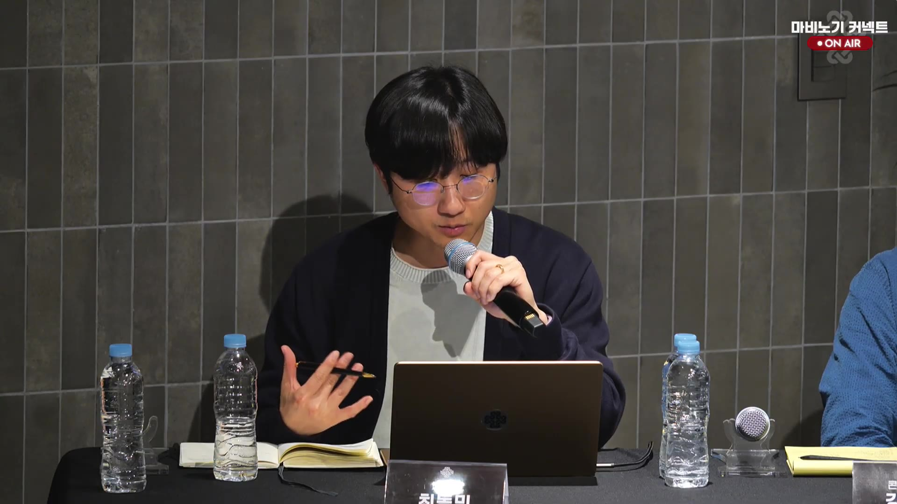</td>
</tr>
<tr>
<td>23:30~23:42</td>
<td>장인/명장 공정성</td>
<td>장인 아이템 공급과 경제적 메리트를 의도했지만 설계 난도가 높았고, 시즌 전환 시 경쟁 완화 장치를 더 검토하겠다고 했다. 기존 자산 우위와 서버별 격차도 일부 불가피하다고 설명했다.</td>
<td>videos/lSX4UvPFIZM/transcripts/chunk_000000.txt~chunk_000023.txt</td>
</tr>
<tr>
<td>00:10~00:45</td>
<td>화면/대기시간</td>
<td>방송 재개 전 대기시간 화면이 길게 이어졌고, 카운트다운만 감소하는 같은 화면이 반복됐다.</td>
<td>videos/lSX4UvPFIZM/captures/frame_000513.jpg</td>
</tr>
<tr>
<td>00:45~01:20</td>
<td>화면</td>
<td>ON AIR 패널 토크 화면으로 재개되어 마비노기 커넥트 오버레이와 디렉터 최동민 명패가 다시 보였다.</td>
<td>videos/lSX4UvPFIZM/captures/frame_000657.jpg 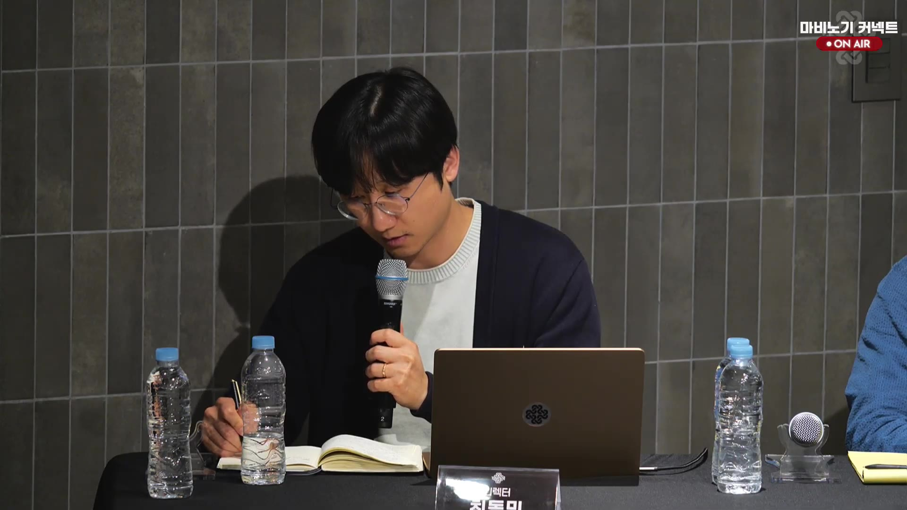</td>
</tr>
<tr>
<td>00:45~01:20</td>
<td>항공교육/비행범선/교역</td>
<td>항공교육 시간이 길고 비행범선 속도·레드드래곤/와이번·범선 위치렉이 불편하다는 지적에 대해, 구조상 제약은 있지만 이벤트 빈도와 위치/판정 개선을 천천히 검토하겠다고 답했다.</td>
<td>videos/lSX4UvPFIZM/transcripts/chunk_000204.txt~chunk_000218.txt</td>
</tr>
<tr>
<td>01:20~01:35</td>
<td>교역 취소 범위</td>
<td>교역 구매 프로세스 안에서 완전 구매 완료 전이라면 일정 시간 내 취소 가능하도록 개선하겠다고 했다.</td>
<td>videos/lSX4UvPFIZM/transcripts/chunk_000219.txt~chunk_000220.txt</td>
</tr>
<tr>
<td>01:20~01:35</td>
<td>교역 이동속도 옵션/세공</td>
<td>던전 전리품은 전투 포지션에 맞춰야 해서 어렵다고 했고, 일반 의상 세공 테이블 관련 논의는 이어졌다.</td>
<td>videos/lSX4UvPFIZM/transcripts/chunk_000221.txt~chunk_000226.txt</td>
</tr>
<tr>
<td>01:35~01:50</td>
<td>화면</td>
<td><code>생활 콘텐츠</code> 질문 슬라이드가 표시됐고, 교역 보상 개선 요청과 낭만 농장·달빛섬 패치 계획 같은 생활 관련 항목이 보였다.</td>
<td>videos/lSX4UvPFIZM/captures/frame_000682.jpg 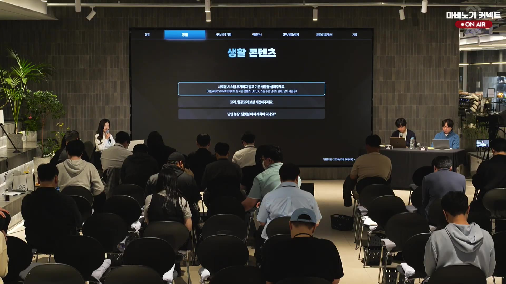</td>
</tr>
<tr>
<td>01:35~01:50</td>
<td>생활 편의</td>
<td>교역 보상은 세공 강화보다 보상 자체를 강화하는 방향이 맞고, 채집속도 세공과 풍년가 중첩 표시는 하반기 표시 강화 업데이트와 함께 진행하겠다고 했다. 제작 카테고리 분리는 신규·복귀 유저 혼선을 우려해 신중히 보겠다고 답했다.</td>
<td>videos/lSX4UvPFIZM/transcripts/chunk_000227.txt~chunk_000233.txt</td>
</tr>
<tr>
<td>01:50~02:10</td>
<td>제작 경제 설계</td>
<td>제작 성공 확률 99%를 유지하는 것은 100%와 경제 설계상 의미가 다르기 때문이라고 설명했고, 목공 제작 리라의 블랙스미스 효과 문제는 빠르게 진행하겠다고 했다.</td>
<td>videos/lSX4UvPFIZM/transcripts/chunk_000234.txt~chunk_000240.txt</td>
</tr>
<tr>
<td>02:10~02:30</td>
<td>악기 연주/튜너/합주</td>
<td>악기 연주 콘텐츠에서 튜너 가격, 16명 합주 부담, 노래 파트 미적용 문제가 제기됐고, 기간제 튜너 대여·키트 판매 주기 단축·노래 적용을 모두 진행하겠다고 했다.</td>
<td>videos/lSX4UvPFIZM/transcripts/chunk_000241.txt~chunk_000248.txt</td>
</tr>
<tr>
<td>02:30~02:55</td>
<td>악보 보관/즐겨찾기/마법 악보</td>
<td>악보를 인벤토리·은행·본인만의 악보함처럼 저장하거나 즐겨찾기/게시판 연장선으로 관리하고 싶다는 의견이 나왔고, 책과 달리 악보는 각 아이템이 내부 데이터와 용량을 따로 차지해 패스/DB 공간 문제와 훼손 위험이 크다고 설명했다. 대신 제목 검색과 즐겨찾기, 나의 악보함 같은 보조 기능은 검토하겠다고 했다. 사장된 마법 악보를 버프형으로 리워크해 음악 콘텐츠를 살리자는 제안도 이어졌고, 악보가 들어간 자부키엘은 펫 인벤토리에 보관할 수 없다는 제한도 정리됐다.</td>
<td>videos/lSX4UvPFIZM/transcripts/chunk_000249.txt~chunk_000276.txt</td>
</tr>
<tr>
<td>02:55~03:10</td>
<td>항공교역 전투 발리스타</td>
<td>비행 범선 전투에서 발리스타가 작게 보여 다른 캐릭터에 가려지고, 오브젝트 타겟팅도 잘 안 잡힌다는 문제에 대해 좋은 의견이라며 반영 가능하다고 했다.</td>
<td>videos/lSX4UvPFIZM/transcripts/chunk_000260.txt~chunk_000262.txt</td>
</tr>
<tr>
<td>03:10~03:20</td>
<td>설치 악기 교체/전용 파트너/악보 길이</td>
<td>악보를 끼운 상태에서 설치 악기를 교체하고 싶다는 요청, 전용 파트너의 악보 보관 문제, 악보 길이 확대 요청이 이어졌다. 일부는 구조상 어렵지만 나머지는 가능한지 다시 확인한 뒤 차후 안내하겠다고 했다.</td>
<td>videos/lSX4UvPFIZM/transcripts/chunk_000263.txt~chunk_000266.txt</td>
</tr>
<tr>
<td>03:20~03:30</td>
<td>합주 인원 조절</td>
<td>합주가 최대 16인까지라 인원 조절이나 완화 장치가 필요하다는 의견에 대해, 현실적으로 어려운 부분이 있어 내부 검토가 필요하다고 답했다.</td>
<td>videos/lSX4UvPFIZM/transcripts/chunk_000277.txt~chunk_000280.txt</td>
</tr>
<tr>
<td>03:30~03:40</td>
<td>새 악기 추가/합주 부담 완화</td>
<td>지방 서버 악단과 외부 연주 인원 확보의 어려움, 작은북·큰북·심볼즈를 드럼 하나로 합쳤던 과거 패치 사례, 새로운 금관 악기 요구가 제기됐다. 답변은 가야금을 시작으로 새로운 악기 시도를 오랜만에 다시 시작했으며 앞으로도 이어가겠다는 취지였다.</td>
<td>videos/lSX4UvPFIZM/transcripts/chunk_000281.txt~chunk_000284.txt</td>
</tr>
<tr>
<td>03:40~03:55</td>
<td>천장 시스템</td>
<td>성실 플레이를 통해 고가치 보상을 확정적으로 얻는 천장 시스템 도입이 필요하다는 제안이 나왔고, 답변은 최상위 던전에는 어렵지만 중간 성장 단계 던전에는 필요할 수 있다는 방향이었다.</td>
<td>videos/lSX4UvPFIZM/transcripts/chunk_000288.txt~chunk_000291.txt</td>
</tr>
<tr>
<td>03:55~04:35</td>
<td>생활/교역 보상 개선</td>
<td>교역 보상은 5단계 대비 6단계 표기가 오해를 불렀고, 시즌 중이라 즉시 바꾸긴 어렵지만 더 자연스럽게 느껴지도록 개선하겠다고 했다. 두카트 소모처는 전투 성장을 생활에 묶는 방향이 아니라, 거래 가능한 형태로 경제 영향을 검토해 선보이는 쪽이 맞다고 답했다. 관련 개선은 하반기 목표로 보겠다고 했다.</td>
<td>videos/lSX4UvPFIZM/transcripts/chunk_000295.txt~chunk_000307.txt</td>
</tr>
<tr>
<td>04:10~04:20</td>
<td>화면</td>
<td>최신 캡처 747~906는 흰색 빈 화면으로, 새 슬라이드나 패널 정보가 보이지 않았다.</td>
<td>videos/lSX4UvPFIZM/captures/frame_000906.jpg</td>
</tr>
<tr>
<td>04:20~현재</td>
<td>화면</td>
<td>907~955 캡처에서 마비노기 커넥트 ON AIR 패널 토크 화면이 다시 보였고, 디렉터 최동민 명패가 확인됐다.</td>
<td>videos/lSX4UvPFIZM/captures/frame_000955.jpg 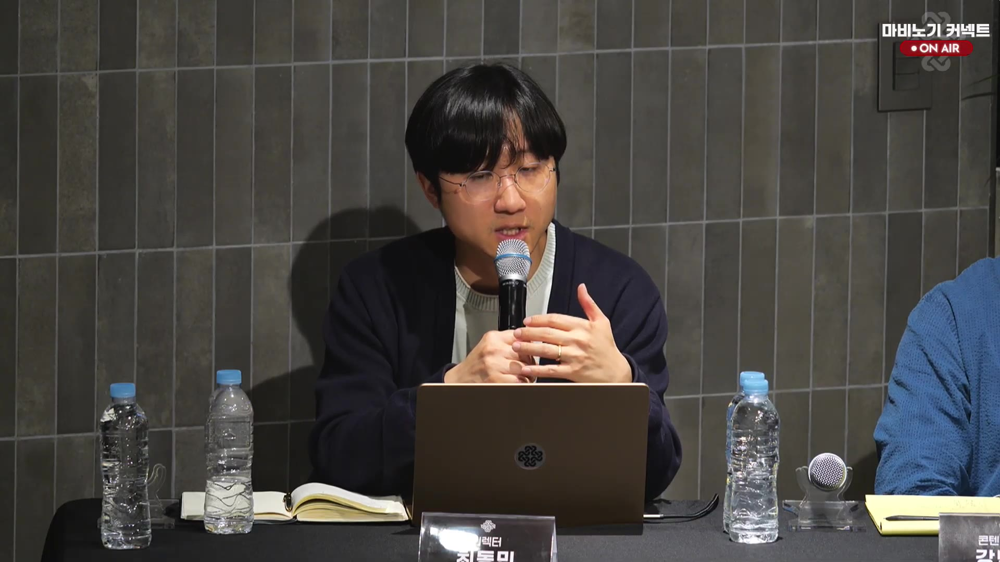</td>
</tr>
<tr>
<td>04:30~현재</td>
<td>화면</td>
<td>객석 Q&A; 진행 장면으로 전환되어, 슬라이드나 패널명 대신 청중 질의 중심 화면이 이어졌다.</td>
<td>videos/lSX4UvPFIZM/captures/frame_000968.jpg</td>
</tr>
<tr>
<td>04:35~04:55</td>
<td>일반 교역 이동 불편</td>
<td>오브젝트와 좁은 길목 때문에 일반 교역 이동이 불편하고, 오스나사 일족 지역처럼 통로가 지나치게 좁아 약탈자 대응이 어렵다는 지적이 나왔다. 벽 미끄러짐 처리나 지형 자체 수정은 현재로선 어렵고, 앞으로 선보일 업데이트에 집중하겠다고 했다.</td>
<td>videos/lSX4UvPFIZM/transcripts/chunk_000315.txt~chunk_000318.txt</td>
</tr>
<tr>
<td>04:55~05:25</td>
<td>낭만 농장/달빛섬 편의성</td>
<td>구조적인 개편은 현재 계획하지 않지만, 설치물 위주의 꾸미기 선택지를 넓히고 신비의 서고 설치물을 추가하는 방향을 준비 중이라고 했다. 달빛섬은 가이드와 후속 보완을 계속하고, 설치물 이사 기능은 기술적으로 어렵지만 다른 클릭/선택 방식 대안은 검토하겠다고 했다. 달빛섬 생산물 일괄 수령은 편의성 개편 과정에서 다뤄보겠다고 했다.</td>
<td>videos/lSX4UvPFIZM/transcripts/chunk_000320.txt~chunk_000329.txt</td>
</tr>
<tr>
<td>05:25~05:35</td>
<td>미니어처 검색/관리</td>
<td>낭만 농장 미니어처의 종류와 위치를 찾을 수 있는 기능이 있으면 생활 유저뿐 아니라 전투 유저에게도 편리할 것이라는 제안이 나왔고, 편의성 개편 과정에서 함께 챙기겠다고 답했다.</td>
<td>videos/lSX4UvPFIZM/transcripts/chunk_000330.txt~chunk_000332.txt</td>
</tr>
<tr>
<td>05:35~05:45</td>
<td>파견 보상 콘텐츠 잠금 오류</td>
<td>자동 파견을 눌렀을 때 잠금이 풀리는 문제가 있다며 검증과 수정을 요청했고, 답변은 내부적으로 다시 확인해 보겠다는 것이었다.</td>
<td>videos/lSX4UvPFIZM/transcripts/chunk_000333.txt~chunk_000334.txt</td>
</tr>
<tr>
<td>05:45~05:55</td>
<td>낭만 농장/달빛섬 지형·배경</td>
<td>달빛섬 지형 변경은 돌아가서 확인이 필요해 확답이 어렵고, 낭만 농장 배경 변경도 앞으로 만들어 갈 콘텐츠에 집중하는 쪽이라 즉답을 주기 어렵다고 했다.</td>
<td>videos/lSX4UvPFIZM/transcripts/chunk_000335.txt~chunk_000340.txt</td>
</tr>
<tr>
<td>05:55~06:05</td>
<td>낭만 농장 방명록 버그</td>
<td>낭만 농장의 방명록 답글이 보이지 않거나 답글을 열 때 아래 방명록이 사라지는 버그가 제기됐고, 해당 버그를 본 기억은 있지만 정확한 재현은 다시 확인해 보겠다고 했다.</td>
<td>videos/lSX4UvPFIZM/transcripts/chunk_000341.txt~chunk_000344.txt</td>
</tr>
<tr>
<td>06:05~06:15</td>
<td>주크박스 동작 범위</td>
<td>낭만 농장/달빛섬에 설치한 주크박스가 끝단에 가면 재생이 멈추고 기본 BGM으로 돌아가는 현상은 버그로 인정됐고, 바로 수정하겠다고 했다.</td>
<td>videos/lSX4UvPFIZM/transcripts/chunk_000346.txt~chunk_000348.txt</td>
</tr>
<tr>
<td>06:15~06:25</td>
<td>농장 통합 요청</td>
<td>낭만 농장·달빛섬·탈틴 농장을 통합해 달라는 의견이 나왔지만, 현재는 기술적으로 어렵고 먼저 낭만 농장과 달빛섬을 더 쉽게 오갈 수 있게 개선한 뒤 각각을 개편해 나가겠다고 했다.</td>
<td>videos/lSX4UvPFIZM/transcripts/chunk_000349.txt~chunk_000350.txt</td>
</tr>
<tr>
<td>06:25~현재</td>
<td>세이크리드 가드/세인트바드 개편 논란</td>
<td>새로 도입한 탱커형 아르카나는 소수 인원 전투에서 더 자유로운 조합을 가능하게 하려는 시도였지만, 검토가 충분하지 않았고 설계 미스가 있었다고 인정했다. 이어진 질의에서는 이전 라이브의 '유저 편의' 설명과 지금의 '기획 실패' 인정이 다르다는 지적이 나왔고, 디렉터는 명확한 기획·설계를 못한 점이 맞다고 답하며 앞으로 선보일 아르카나의 포지션 변경은 없을 것이라고 약속했다.</td>
<td>videos/lSX4UvPFIZM/transcripts/chunk_000351.txt~chunk_000367.txt</td>
</tr>
<tr>
<td>06:40~07:05</td>
<td>세이크리드 가드 참여 비중/지표 해석</td>
<td>브리레이드 일반 파티는 4인 구성이 가장 많고, 세가가 1주차부터 60주차까지 90~95%를 넘는 참여 비중을 유지해 왔다고 그래프로 설명했다. 다만 세가 비중 감소는 예고 이후의 장비 처분·이탈·인파티 타협이 섞인 결과일 수 있으니 지표를 해석할 때 그런 풍기도 함께 봐 달라고 했다.</td>
<td>videos/lSX4UvPFIZM/transcripts/chunk_000397.txt~chunk_000404.txt</td>
</tr>
<tr>
<td>07:05~07:15</td>
<td>세인트바드 포지션 유지</td>
<td>세인트바드는 마비노기에 반드시 필요한 아르카나로 충분히 정착해 있고 세가와는 다른 양상이라, 포지션 변경 계획은 없으며 매력을 계속 개발해 나가겠다고 했다. 지표 영향도는 인정하지만 핵심 원인은 세가 비중과 변화율 자체라고 설명했다.</td>
<td>videos/lSX4UvPFIZM/transcripts/chunk_000405.txt~chunk_000412.txt</td>
</tr>
<tr>
<td>07:15~07:30</td>
<td>세가 개편 강행 이유</td>
<td>세가를 지금 바꾸는 건 수치 때문만이 아니라, 세가가 존재하면 탱딜힐 3포지션 구조가 계속 유지되고 4인 파티가 3인·2인·1인으로 더 내려가는 흐름을 장기적으로 막기 위한 판단이라고 설명했다.</td>
<td>videos/lSX4UvPFIZM/transcripts/chunk_000413.txt~chunk_000417.txt</td>
</tr>
<tr>
<td>07:30~07:40</td>
<td>eternity 일정 영향</td>
<td>라이브에서의 변화는 eternity 전투시연 영상에도 적용되며, 일정에 영향이 있을 수는 있지만 개발 차질이 가지 않도록 최선의 노력을 다하고 있다고 답했다.</td>
<td>videos/lSX4UvPFIZM/transcripts/chunk_000418.txt~chunk_000420.txt</td>
</tr>
<tr>
<td>07:40~08:05</td>
<td>세가 롤백 요구/방향성 재확인</td>
<td>반대 여론이 거세고 설문조사 의견도 같은 방향이라 롤백을 진지하게 다시 고민해 달라는 요청이 이어졌지만, 운영진은 테스트 서버를 통해 방어적 방향성을 충분히 전달하지 못했다는 점을 인정하고 연장 포함한 테스트로 방향성을 더 보여준 뒤 이후에도 고려할 수 있게 하겠다고 답했다.</td>
<td>videos/lSX4UvPFIZM/transcripts/chunk_000423.txt~chunk_000429.txt</td>
</tr>
<tr>
<td>08:05~현재</td>
<td>휴식 재공지/대기시간</td>
<td>잠시 휴식 후 3시 30분부터 다시 이어가겠다고 공지했고, 최신 화면은 00:45 카운트다운이 보이는 마비노기 커넥트 LIVE 대기 화면이다.</td>
<td>videos/lSX4UvPFIZM/transcripts/chunk_000430.txt videos/lSX4UvPFIZM/captures/frame_001427.jpg</td>
</tr>
<tr>
<td>08:15~현재</td>
<td>재개된 ON AIR 패널/세가 개편 재검토</td>
<td>방송이 다시 ON AIR 패널 토크로 재개되었고, 디렉터는 이번 테스트 서버와 다음 주·다다음 주 업데이트를 선보인 뒤 밀레슨 의견을 듣고 세이크리드 가드 개편 도입 여부를 결정하겠다고 했다. 진행자는 계속해서 의견을 받고 있다고 정리했다.</td>
<td>videos/lSX4UvPFIZM/transcripts/chunk_000477.txt~chunk_000480.txt videos/lSX4UvPFIZM/captures/frame_001441.jpg</td>
</tr>
<tr>
<td>08:25~현재</td>
<td>객석 Q&A;/세가 롤백 여론 설명</td>
<td>객석 질문이 이어지며, 탱커 아르카나로 출발한 설계가 노선 변경 뒤 일부 유저에게 배신감으로 받아들여졌고 딜러 테스트 전환 뒤 설득도 충분하지 못해 롤백 여론이 커졌다고 설명했다. 이어 양손검·도끼 성능 차, 저가 세가와 고가 세가의 변별력, 다계정 투표 어뷰징 우려, 희생의 응징·정령 실체·추장 슬롯 우선순위 문제가 제기됐고, 운영진은 세가 조정 때 단순 롤백이 아니라 배럭 이슈와 변별력을 함께 고려하고 투표 어뷰징이 되지 않도록 보완하겠다고 답했다.</td>
<td>videos/lSX4UvPFIZM/transcripts/chunk_000481.txt~chunk_000503.txt videos/lSX4UvPFIZM/captures/frame_001549.jpg</td>
</tr>
<tr>
<td>08:40~09:00</td>
<td>세인트바드 역할 부담/기믹 설계</td>
<td>세인트바드는 전투 중 장막 유지, 고동 설치, 봉파 타이밍, 디버프, 위빈 등 수행해야 할 액션이 많아 부담이 크며, 이를 전부 없애긴 어렵지만 꼭 신경 써야 하는 부분은 간소화·통합해 개선하겠다고 했다. 브리르/브론타나스처럼 기믹 때문에 추가 액션이 생기는 설계는 앞으로 더 신중히 보겠다고도 했다. 이어 세인트바드의 메인은 힐링과 음악 버프이며, 음악 버프 링크 보너스 상향, 힐링/음법 타이틀 보강, 구원 MR 유물의 고정값 증가 개선, 은파의 세레 데미지 상향, 하위 던전 솔로 플레이 목표까지 함께 검토하겠다고 답했다.</td>
<td>videos/lSX4UvPFIZM/transcripts/chunk_000514.txt~chunk_000553.txt videos/lSX4UvPFIZM/captures/frame_001552.jpg 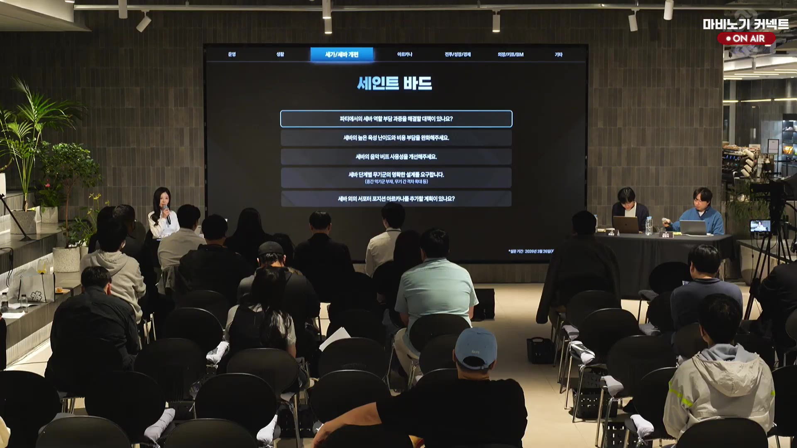</td>
</tr>
<tr>
<td>09:00~현재</td>
<td>다기능 무기/2차 타이틀/성수작</td>
<td>마이크처럼 힐링과 연주를 함께 시전할 수 있는 무기군 아이디어가 제안되자 다음 무기군부터는 이중 부담을 줄이는 방향을 검토하겠다고 했고, 2차 타이틀과 성수작도 세인트바드의 성장 체감이 살아나도록 함께 고민하겠다고 답했다. 이어 타이틀은 힐링 효율과 음악 버프를 양쪽으로 받는 형태를, 성수작은 힐링·음법 장비를 통합했을 때의 장단을 내부 검토하겠다고 했으며, 나이트 브링어/소울 원드 간 간극은 15~20% DPS 상향 기준을 염두에 두고 있었지만 현재는 장막 효율이 의도보다 높아 조정하겠다고 설명했다. 은파의 세레 디버프 방어 감소 옵션과 스킬 수치 표시 방식도 함께 검토하겠다고 답했고, 스킬 툴팁은 빠르게 확인할 수 있는 형태로 확장 가능한지 보겠다고 했다. 2차 타이틀은 다른 던전 시세 영향까지 내부 검토가 필요해 즉답을 미뤘으며, 하나의 무기에 네다섯 줄을 갖춰야 하는 부담과 마이크처럼 한 번에 여러 효과를 담는 설계의 현실성도 함께 언급됐다. 이어 세인트바드의 딜링 스킬은 상위 던전에서 너무 강하면 8업이나 파티 요구 같은 부담이 생길 수 있어 조심스럽게 밸런스를 잡겠다고 설명했다. 하위 던전에서는 힐링 원드만으로도 전투력을 낼 수 있게 설계를 잡고 있으며, 세바 육성 난이도와 비용 부담, 나이트 브링어/세이비어에만 의존하는 힐링 원드 세공 파밍 어려움, 인챈트 중간 단계가 부족해 초보자 허들이 높아지는 문제도 인지하고 있다. 같은 구간의 패널 토크 화면에서는 테이블 앞 이름표가 콘텐츠 리더 강민석으로 확인됐다.</td>
<td>videos/lSX4UvPFIZM/transcripts/chunk_000554.txt~chunk_000592.txt videos/lSX4UvPFIZM/captures/frame_001660.jpg 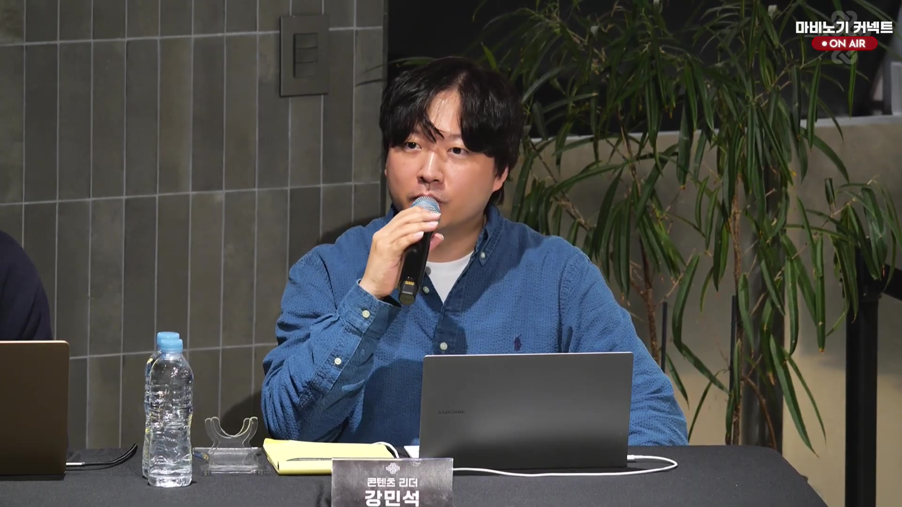</td>
</tr>
<tr>
<td>09:05~현재</td>
<td>화면/세인트 바드</td>
<td>서가/세바 개편 탭의 세인트 바드 질문 슬라이드가 다시 보였고, 파티 역할 부담·육성 난이도·음악 버프·무기군 설계·서포터 아르카나 추가 여부 같은 질문 항목이 표시됐다.</td>
<td>videos/lSX4UvPFIZM/captures/frame_001744.jpg 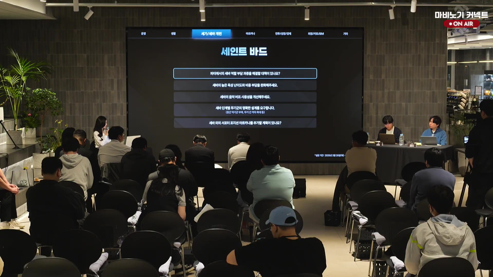</td>
</tr>
<tr>
<td>09:10~현재</td>
<td>화면/세인트 바드</td>
<td>세인트 바드 Q&A; 슬라이드에서 세공/서버 개편 탭의 ‘세바의 높은 육성 난이도와 비용 부담을 완화해주세요’ 항목이 강조됐고, 음악 버프 사용성·무기군 설계·서포터 아르카나 추가 계획이 다시 보였다.</td>
<td>videos/lSX4UvPFIZM/captures/frame_001768.jpg 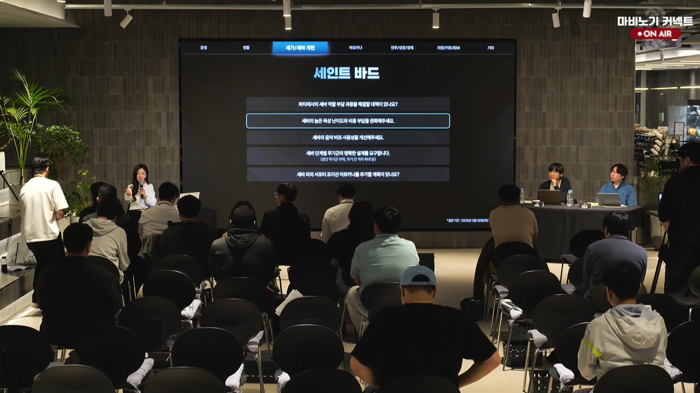</td>
</tr>
<tr>
<td>09:15~09:25</td>
<td>세바 비용/천장 시스템</td>
<td>점성술 카드와 성수의 천장 시스템 도입 가능성을 물었고, 운영진은 이미 많은 비용을 들인 유저가 있어 영향이 클 수 있으므로 현재는 고려하지 않지만 실제 소모 비용을 확인한 뒤 완화 가능성을 다음 라이브에서 다시 안내하겠다고 했다.</td>
<td>videos/lSX4UvPFIZM/transcripts/chunk_000593.txt~chunk_000600.txt</td>
</tr>
<tr>
<td>09:25~09:35</td>
<td>세인트바드 버프 메리트/링크 효과</td>
<td>세인트바드의 버프적 메리트를 딜러와 더 차별화해 달라는 요청에 대해, 수치를 과도하게 올리기보다 밸런스를 고려한 상향치를 잡아 링크 효과의 고정치 반영이나 음악 버프 성장 반영 방식 등을 함께 검토하겠다고 답했다.</td>
<td>videos/lSX4UvPFIZM/transcripts/chunk_000601.txt~chunk_000604.txt</td>
</tr>
<tr>
<td>09:35~09:45</td>
<td>하변산/고변산 표기 및 스탯 표시</td>
<td>합연산·곱연산 표기가 시인성이 부족하다는 지적에 대해, 증가=합변산·증폭=고변산처럼 명확하게 구분해 안내하고 캐릭터 정보창에서 음악 버프와 힐링 수치도 바로 확인할 수 있게 하반기 표기 강화를 검토하겠다고 했다.</td>
<td>videos/lSX4UvPFIZM/transcripts/chunk_000605.txt~chunk_000611.txt</td>
</tr>
<tr>
<td>09:45~현재</td>
<td>세인트바드 음악버프 사용성/전장비 자동 교체</td>
<td>세인트바드의 전행비 세팅을 스킬별 번호 지정으로 관리해, 예를 들어 전장은 1번·비바체는 2번처럼 미리 지정한 장비로 자동 교체되며 스킬이 발동되는 방식의 편의 개선을 여름 업데이트에 맞춰 준비 중이라고 했다. 개발 완료 뒤에는 실제 편의성 검증도 진행하겠다고 밝혔다.</td>
<td>videos/lSX4UvPFIZM/transcripts/chunk_000612.txt~chunk_000614.txt</td>
</tr>
<tr>
<td>09:50~현재</td>
<td>전장/비바체 체크 해제 불편</td>
<td>전장을 받지 않고 비바체만 받도록 설정해도 자신이 부는 버프라 전장의 서곡이 자기에게 들어오는 불편이 제기됐고, 딜러가 죽었을 때 전장을 풀고 다시 비바체를 불어야 하는 번거로움이 추가 개선점으로 언급됐다. 운영진은 시스템 설계 당시에도 비슷한 고민을 했다고 언급하며 검토가 이어졌다.</td>
<td>videos/lSX4UvPFIZM/transcripts/chunk_000616.txt~chunk_000617.txt</td>
</tr>
<tr>
<td>10:00~10:10</td>
<td>음악버프 수치 표시/툴팁</td>
<td>음악버프 효과가 실제로 적용되지 않더라도 수치 자체는 보여줄 수 있는 형태를 고민 중이며, 스킬 위에 마우스오버를 했을 때 전장의 서곡이나 비바체 퍼센트를 표기하는 업데이트가 이뤄지면 좋겠다는 의견이 나왔다. 운영진은 그런 방식의 개선을 검토하겠다고 답했다.</td>
<td>videos/lSX4UvPFIZM/transcripts/chunk_000618.txt~chunk_000619.txt</td>
</tr>
<tr>
<td>10:10~10:20</td>
<td>1차 타이틀 통합/공용 타이틀 효과</td>
<td>세인트바드에서 음악버프 스킬을 사용할 때 1차 타이틀이 자주 바뀌는 문제를 지적하며, 마이스트로처럼 모든 음악버프 스킬의 효과를 올려주는 1차 타이틀을 통합하고 전행비·음악 관련 공용 타이틀 효과로 전장·비바체·행진곡을 한꺼번에 받는 방향을 요청했다. 운영진은 하나의 음악 장비술로 쓰는 딜러들도 불편할 수 있음을 인정하며 어떻게 선보일지 고민 중이라고 답했다.</td>
<td>videos/lSX4UvPFIZM/transcripts/chunk_000620.txt~chunk_000626.txt</td>
</tr>
<tr>
<td>10:20~10:30</td>
<td>세인트바드 힐링 타게팅 편의</td>
<td>파티 UI에서 이름을 눌러 힐을 보내는 방식, 패시브 타게팅이 치유 스킬을 먹어버리는 문제, 컨트롤+클릭 같은 조작 편의가 제기됐고, 운영진은 초기 기획 때부터 고민했지만 구현 난도가 높아 미뤘다고 설명했다. 대신 치유의 성결처럼 대상형 스킬에서 패시브 타게팅을 끌 수 있는 옵션을 준비하고 있다고 답했다.</td>
<td>videos/lSX4UvPFIZM/transcripts/chunk_000627.txt~chunk_000632.txt</td>
</tr>
<tr>
<td>10:30~10:35</td>
<td>투한 표시/디버프창 표기</td>
<td>전장의 서곡·음악버프·상태이상 지원과 함께 투한 효과가 파티원 툴팁에 표시되면 좋겠다는 요청이 나왔고, 운영진은 파티창 공간이 부족하면 버프가 아닌 디버프 창 쪽으로 옮겨 남은 시간과 on/off 상태를 함께 보이게 하는 방안을 검토하겠다고 했다.</td>
<td>videos/lSX4UvPFIZM/transcripts/chunk_000633.txt~chunk_000639.txt</td>
</tr>
<tr>
<td>10:35~10:45</td>
<td>이면/인결 시인성 및 부담 완화</td>
<td>이면과 인결의 가시성이 낮고 붕괴처럼 채팅 콜에 의존하는 상황이 많다는 지적에 대해, 데칼이 많은 보스 패턴 환경에서 효과가 더 잘 보이도록 시인성을 강화하겠다고 했다. 핑 시스템으로 일부 해소될 수는 있지만, 보스 디버프 창 쪽으로 옮기거나 효과 자체를 더 근본적으로 바꾸는 쪽이 낫다는 의견도 나왔고, 운영진은 공용 특성 부담과 사용 빈도를 함께 보며 이펙트 개선과 사용성 조정을 계속 검토하겠다고 답했다.</td>
<td>videos/lSX4UvPFIZM/transcripts/chunk_000640.txt~chunk_000648.txt</td>
</tr>
<tr>
<td>10:45~10:50</td>
<td>전장/비바체 쿨타임 조절</td>
<td>세인트바드가 전장이나 비바체를 돌릴 때 10초인 쿨타임이 긴급 상황에서 부담이 된다는 요청이 나왔고, 운영진은 슈퍼아머를 붙이는 방식보다는 쿨타임 자체를 대폭 줄이는 쪽으로 조정하겠다고 했다.</td>
<td>videos/lSX4UvPFIZM/transcripts/chunk_000649.txt~chunk_000652.txt</td>
</tr>
<tr>
<td>10:50~10:55</td>
<td>불협화음 디버프 지속시간/표시</td>
<td>세인트바드 불협화음 디버프가 최대 효율을 유지하기에 지속시간이 너무 짧고, 한 번 끊겼는지 재적용이 필요한지 수치나 마우스오버로 확인할 방법이 없다는 피드백이 나왔다. 운영진은 다른 디버프와 비슷한 템포를 낼 수 있도록 지속시간을 더 길게 상향하고, 표기 개선도 함께 검토하겠다고 답했다.</td>
<td>videos/lSX4UvPFIZM/transcripts/chunk_000653.txt~chunk_000656.txt</td>
</tr>
<tr>
<td>10:55~현재</td>
<td>음성/화면</td>
<td>힘의 결속은 실사용이 사실상 딜 증가용에 가깝기 때문에 10초 유지형 스킬로 단순화해도 되겠다는 제안이 나왔고, 운영진은 그렇게 개선하는 방향을 준비하겠다고 답했다. 이어 오전 5시 기준 총 15시간을 진행한 뒤 유동적으로 휴식 시간을 갖기로 공지됐으며, 말미에는 00:21→00:11→00:01 카운트다운 대기 화면 뒤 MC 김효진 아나운서 진행 화면과 MABINOGI CONNECT LIVE 타이틀 화면으로 전환됐다.</td>
<td>videos/lSX4UvPFIZM/transcripts/chunk_000657.txt~chunk_000663.txt videos/lSX4UvPFIZM/transcripts/chunk_000717.txt~chunk_000718.txt videos/lSX4UvPFIZM/captures/frame_002150.jpg 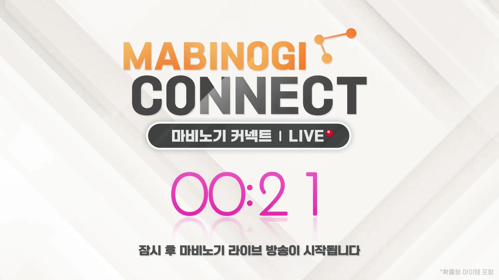 videos/lSX4UvPFIZM/captures/frame_002154.jpg  videos/lSX4UvPFIZM/captures/frame_002159.jpg </td>
</tr>
</tbody>
</table>
## 음성 전사 요약

- 249~396번 구간에서는 악기 연주 콘텐츠의 보관/검색/개편 요청, 교역 보상 6단계 표기 오해와 두카트 소모처 방향, 일반 교역 이동 불편, 낭만 농장·달빛섬 편의성 개편, 미니어처 검색, 파견 잠금 오류, 지형·배경 변경 문의, 낭만 농장 방명록 버그, 주크박스 동작 범위, 농장 통합 요청, 세이크리드 가드/세인트바드 개편 논쟁과 참여 비중 그래프 설명, 세가 딜/생존력 조정, 테스트 서버 연장, 3주 지연 이유와 커뮤니케이션 미숙, 데이터 원본 클리핑 해명까지 생활·전투형 편의와 밸런스 요청이 연달아 이어졌다.
- 397~404번 구간에서는 브리레이드 파티 비중이 1주차부터 60주차까지 어떻게 변했는지 설명하며, 세이크리드 가드 참여 비중은 여전히 높지만 장비 처분·이탈·인파티 타협 같은 풍기도 지표에 섞여 있을 수 있다고 보충했다.
- 405~412번 구간에서는 세인트바드가 이미 필요한 아르카나로 정착했으며 세가와는 다른 양상이라 포지션 변경 계획이 없고, 지표 영향은 인정하지만 핵심 원인은 세가 비중과 변화율 자체라고 정리했다.
- 413~417번 구간에서는 세가 개편을 왜 지금 강행하느냐는 질문에 대해, 수치 때문만이 아니라 탱딜힐 3포지션 구조와 4인→3인·2인·1인 파티 흐름을 장기적으로 막기 위한 판단이라고 설명했다.
- 418~420번 구간에서는 라이브의 변화가 eternity 전투시연 영상에도 적용되며 일정 영향이 있을 수 있지만, 개발 차질이 가지 않도록 최선을 다하겠다고 답했다.
- 420~422번 구간에서는 오전 3시를 지나 13시간가량 진행한 상태라 유동적 휴식 시간을 실제로 적용하고, 30분 휴식 후 이어가기로 공지했다.
- 423~429번 구간에서는 반대 여론과 설문 의견이 같은 방향이라 롤백 재검토 요청이 이어졌고, 운영진은 테스트 서버로 방어적 방향성을 충분히 전달하지 못했음을 인정한 뒤 연장 포함한 테스트로 방향성을 더 보여주겠다고 답했다.
- 430번 구간에서는 3시 30분부터 재개하겠다는 재공지와 함께, 최신 화면이 19:15 카운트다운 대기 화면으로 다시 전환됐음을 확인했다.
- 485~513번 구간에서는 세가 롤백 여론이 이어지며, 양손검·도끼 성능 차, 저가 세가와 고가 세가의 변별력, 다계정 투표 어뷰징 우려, 희생의 응징·정령 실체·추장 슬롯 우선순위 문제가 추가로 제기됐고, 운영진은 세가 조정 때 단순 롤백이 아니라 배럭 이슈와 변별력을 함께 고려하고 투표 어뷰징이 되지 않도록 보완하겠다고 약속했다.
- 514~529번 구간에서는 세인트바드가 전투 중 해야 할 액션이 너무 많아 부담이 크다는 지적에 대해, 꼭 신경 써야 하는 부분은 간소화·통합하고 기믹이 추가되는 설계는 더 신중히 보겠다고 답했다.
- 530~541번 구간에서는 세인트바드의 메인은 힐링과 음악 버프이며, 링크 보너스 상향, 힐링/음법 타이틀, 구원 MR 유물의 고정값 증가 개선, 은파의 세레 데미지, 하위 던전 솔로 플레이 목표까지 함께 검토하겠다고 정리했다.
- 542~553번 구간에서는 구원 MR 유물의 효율을 스펙 상승에도 의미 있게 유지하도록 비율형으로 조정하겠다는 답변과 함께, 하위 던전에서 기본 힐링 완드만으로 플레이할 수 있는 보상감 강화 계획이 나왔다.
- 554~592번 구간에서는 마이크처럼 힐링과 연주를 함께 시전할 수 있는 다기능 무기 아이디어가 제안됐고, 다음 무기군부터 이중 부담을 줄이는 방향과 2차 타이틀·성수작 보정, 나이트 브링어/소울 원드 간 간극, 스킬 툴팁 확장, 은파의 세레 디버프 표시 방식, 네다섯 줄을 맞춰야 하는 무기 세공 부담, 하위 던전 솔로 플레이, 힐링 원드 세공 파밍, 세공 파밍 경로 확대, 인챈트 단계 허들, 딜링 스킬 밸런스까지 함께 고민하겠다는 답이 나왔다.
- 593~611번 구간에서는 세바의 점성술 카드·성수 천장 시스템 도입 요청에 대해 기존 투자 유저 영향이 커 당장은 보류하되 실제 소모 비용을 확인해 다음 라이브에서 다시 안내하겠다고 했고, 합연산·곱연산 표기를 증가/증폭처럼 더 명확하게 구분하고 캐릭터 정보창에서 음악 버프·힐링 수치를 바로 확인하게 하는 표기 강화를 하반기 목표로 검토하겠다고 했다.
- 612~617번 구간에서는 세인트바드의 음악버프 사용성을 개선하기 위해 전행비 세팅을 스킬별 번호로 관리해 자동 교체되는 방식이 여름 업데이트에 맞춰 준비 중이며, 전장을 끄고 비바체만 유지하려는 경우에도 자기 버프가 어떻게 남는지까지 포함해 추가 개선안을 검토하고 있다고 답했다.
- 618~626번 구간에서는 음악버프가 실제로 적용되지 않더라도 수치와 툴팁을 보여주는 표기 개선, 전장의 서곡/비바체 퍼센트 마우스오버 표기, 1차 타이틀 통합과 전용 세팅 정리, 공용 타이틀 효과로 전장·비바체·행진곡을 한꺼번에 받는 방식 같은 세인트바드 사용성 요청이 이어졌다.
- 627~648번 구간에서는 세인트바드 힐링 타게팅 편의, 파티 툴팁의 투한 표시, 이면·인결 시인성 개선, 디버프창 표기 전환, 데칼이 많은 보스 환경에서의 가시성 확보와 패시브 타게팅 차단 옵션이 논의됐고, 운영진은 이름 클릭 힐링은 구현이 어렵지만 버프/디버프 표기와 시인성 개선은 순차 반영하겠다고 했다.
- 649~656번 구간에서는 전장/비바체 쿨타임을 대폭 줄이는 조정과 불협화음 디버프 지속시간·표시 개선이 이어졌고, 운영진은 슈퍼아머 부여보다 쿨타임 자체를 줄이는 쪽이 맞으며 지속시간도 다른 디버프 수준으로 늘리겠다고 답했다.
- 657~663번 구간에서는 힘의 결속을 10초 유지형 딜 버프로 단순화하자는 제안이 나왔고, 운영진은 그렇게 개선하는 방향을 준비하겠다고 했다.
- 663~716번 구간에서는 오전 5시 기준 총 15시간 진행 후 유동적으로 휴식 시간을 갖기로 공지됐고, 대부분의 청크는 무음이었다. 717~718번 구간에서는 논의가 길어져 잠시 양해를 구하며 대기시간을 연장한다는 추가 공지가 나왔다.
## 주요 화면 캡처

### 방송 재개 ON AIR 패널 화면

대기시간이 끝난 뒤 ON AIR 패널 토크가 다시 시작된 장면으로, 항공·교역 관련 질의응답이 이어졌다.

### 콘텐츠 리더 강민석 패널 화면

세인트바드 Q&A가 이어지는 패널 토크 화면으로, 테이블 앞 이름표에 콘텐츠 리더 강민석이 보였다.

### 생활 콘텐츠 질문 슬라이드

생활 탭이 선택된 질문 슬라이드가 표시됐고, 교역 보상 개선 요청과 낭만 농장·달빛섬 패치 계획 같은 생활 관련 항목이 보였다.

### 휴식 후 대기 화면

휴식 후 다시 대기 화면이 표시되며 00:45 카운트다운과 시작 안내 문구가 보였다.

### 재개된 ON AIR 패널 화면
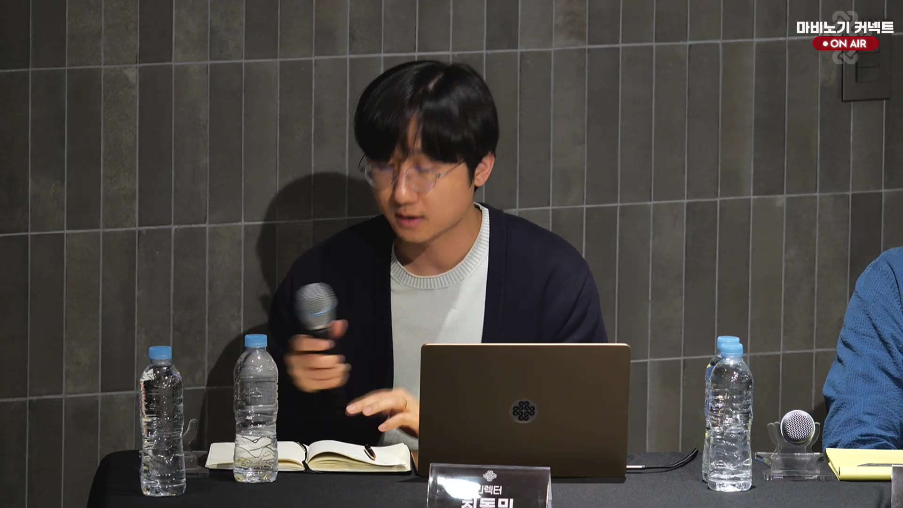

휴식 뒤 방송이 다시 재개되어 디렉터 발언과 진행자의 질의 재개가 이어지는 장면이다.

### 세인트바드 질문 슬라이드

세인트바드 역할 부담과 기믹 설계 개선을 묻는 질의 슬라이드로, 상단에 세바/세바 개편 탭이 보였다.

### 최신 ON AIR 패널 화면
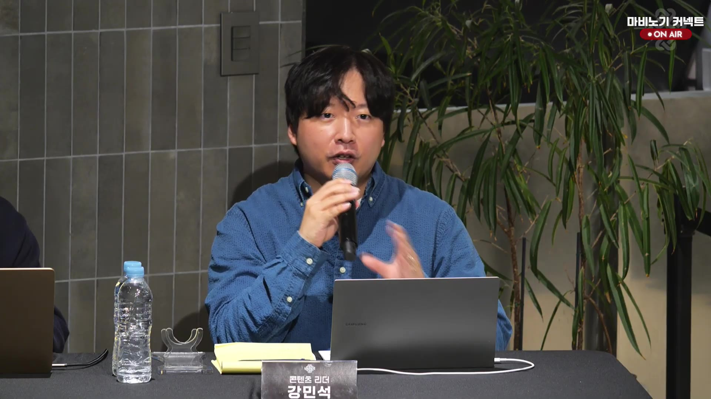

콘텐츠 리더 강민석 이름표가 보이는 ON AIR 패널 토크가 다시 이어졌고, 객석 Q&A 뒤에도 세인트바드 사용성 논의가 계속됐다.

### 최신 세인트 바드 질문 슬라이드
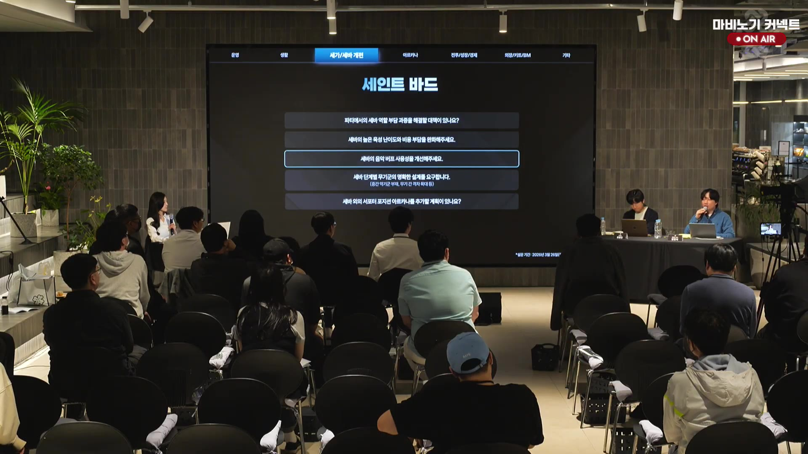

세인트 바드 관련 질문 항목이 다시 떠서 파티 부담, 육성 비용, 음악 버프 사용성, 무기군 설계, 서포터 아르카나 추가 여부가 보였다.

### MC 김효진 진행 화면

방송 말미에 MC 김효진 아나운서가 테이블 앞에서 진행하는 온에어 장면이 잡혔다.

### 최신 대기시간 화면

마비노기 커넥트 LIVE가 타이틀 화면으로 전환되어 방송 시작 분위기로 넘어갔다.
## 최종 정리

- 2부는 명장/장인 공정성 논의에서 시작해 항공교역, 물물교역, 생활 편의, 제작 경제, 악기 연주 편의성으로 넓어졌다.
- 항공교육 시간, 비행범선/와이번/레드드래곤, 범선 위치렉과 항공교역 전투 가시성 같은 불편은 구조상 제약이 있지만 천천히 개선을 검토하겠다는 쪽으로 정리됐다.
- 교역 보상 6단계 표기는 오해 소지가 있었고, 두카트 소모처는 전투 성장을 생활에 묶지 않는 선에서 경제 영향까지 고려해 보겠다는 답이 나왔다.
- 악보 저장/검색/즐겨찾기, 합주 인원 조절, 새 악기 추가, 설치 악기 교체, 전용 파트너 보관, 악보 길이 확대, 마법 악보 리워크 같은 음악·생활 편의 요청이 이어졌다.
- 낭만 농장·달빛섬은 구조 개편보다 설치물, 가이드, 일괄 수령, 미니어처 검색 같은 편의성 개선이 중심이었고, 주크박스 버그와 낭만 농장 방명록 버그도 함께 확인됐다.
- 세이크리드 가드/세인트바드 구간에서는 브리레이드 1~60주 파티 비중 자료를 바탕으로 세가 비중과 변화율을 설명했고, 세인트바드는 이미 필요한 아르카나로 정착해 포지션 변경 계획이 없다고 했다.
- 세가 개편 강행은 단순 수치 문제가 아니라 탱딜힐 3포지션 구조와 4인→3인·2인·1인 파티 흐름을 장기적으로 보며 결정한 것으로 설명됐고, eternity 일정에도 변화가 적용되지만 개발 차질은 최소화하겠다고 했다.
- 반대 여론과 설문 의견이 강하게 이어졌지만, 운영진은 테스트 서버로 방향성을 더 보여주고 롤백 여부도 다시 검토하겠다고 답했다.
- 방송은 30분 휴식 후 다시 ON AIR 패널 토크로 재개되었고, 디렉터는 이번 테스트 서버와 다음 주·다다음 주 업데이트를 먼저 선보인 뒤 밀레슨 의견을 듣고 세이크리드 가드 개편 도입 여부를 결정하겠다고 밝혔다.
- 이후 객석 Q&A로 넘어가며, 세가 롤백 여론은 탱커 아르카나로 시작한 설계의 노선 변경과 충분하지 못한 설득 과정에서 비롯됐다는 설명이 나왔다.
- 휴식 직후에는 카운트다운 대기 화면(frame_001427)이, 재개 후에는 ON AIR 패널 화면(frame_001441)이, 이후에는 콘텐츠 리더 강민석이 보이는 패널 Q&A 화면(frame_001660)이 확인됐다.
- 후속 질의에서는 양손검·도끼 성능 차, 저가 세가와 고가 세가의 변별력, 다계정 투표 어뷰징 우려, 희생의 응징·정령 실체·추장 슬롯 우선순위 문제가 추가로 제기됐고, 운영진은 내부 검토 후 개선 가능성을 보겠다고 답했다.
- 세인트바드 구간에서는 전투 중 수행해야 할 액션이 너무 많아 부담이 크다는 지적이 나왔고, 운영진은 꼭 신경 써야 하는 부분은 간소화·통합해 개선하겠다고 답했다.
- 이어서 세인트바드의 메인은 힐링과 음악 버프라는 점이 다시 확인됐고, 링크 보너스, 2차 타이틀, 구원 MR 유물, 은파의 세레 데미지, 하위 던전 솔로 플레이 보상까지 함께 손보겠다는 방향이 나왔다.
- 마지막에는 다기능 무기와 성수작/2차 타이틀 보정 논의까지 이어지며, 세인트바드의 이중 부담을 줄이는 다음 무기군 설계와 나이트 브링어/소울 원드 간 간극 조정, 스킬 툴팁 확장, 무기 세공 부담 완화, 하위 던전 솔로 플레이, 힐링 원드 세공 파밍, 세공 파밍 경로 확대, 인챈트 단계 허들, 딜링 스킬 밸런스가 함께 검토됐다.
- 후반 세부 Q&A에서는 점성술 카드·성수 천장 시스템은 기존 투자 유저 영향이 커 당장은 보류하되 실제 비용을 확인해 완화 가능성을 다시 보겠다고 했고, 세인트바드 버프 메리트와 링크 효과는 밸런스 패치로 더 차별화하겠다는 방향이 나왔다.
- 이어 합연산·곱연산 표기를 증가/증폭처럼 명확히 나누고 캐릭터 정보창에서 버프·힐링 수치를 바로 보는 표기 개선, 전행비를 스킬별로 자동 교체하는 사용성 개선이 다음 업데이트 축으로 제시됐다.
- 이어 전장을 받지 않는 세팅에서 자기 버프가 어떻게 남는지, 딜러 사망 후 다시 스킬을 바꿔야 하는 번거로움까지 포함해 세인트바드 사용성 개선 범위가 더 넓게 잡혔다.
- 음악버프 수치와 툴팁 표시, 전장의 서곡/비바체 퍼센트 확인, 1차 타이틀 통합, 공용 타이틀 효과 같은 세부 사용성 요청도 계속 추가됐다.
- 마이스트로 1차 타이틀처럼 모든 음악버프 스킬 효과를 올려주는 통합 타이틀이 있으면 좋겠다는 제안도 나왔다.
- 세인트바드 후속 Q&A에서는 힐 타게팅 편의, 투한 표시, 이면·인결 시인성, 디버프창 표기 전환, 데칼 많은 보스 환경에서의 가시성 확보가 추가로 논의됐고, 운영진은 구현 난도와 공간 제약을 인정하면서도 옵션/표기 개선부터 순차 반영하겠다고 답했다.
- 이어진 구간에서는 전장/비바체 10초 쿨타임을 낮추고 불협화음 디버프 지속시간과 수치 표기를 손보는 요청이 새로 나왔으며, 운영진은 쿨타임은 대폭 줄이고 지속시간도 더 길게 조정하겠다고 했다.
- 다시 뜬 세인트 바드 질문 슬라이드에서는 파티 부담, 육성 비용, 음악 버프 사용성, 무기군 설계, 서포터 아르카나 추가 여부 항목이 재확인됐다.
- 이후에는 오전 5시 기준 총 15시간 진행 후 유동적 휴식 공지가 나왔고, 말미에는 00:21→00:11→00:01 카운트다운 대기 화면 뒤 MC 김효진 아나운서 진행 화면과 MABINOGI CONNECT LIVE 타이틀 화면으로 전환됐다.
- 캡처와 오디오 ffmpeg 프로세스가 종료되어 현재는 정리 상태로 마무리됐다.

