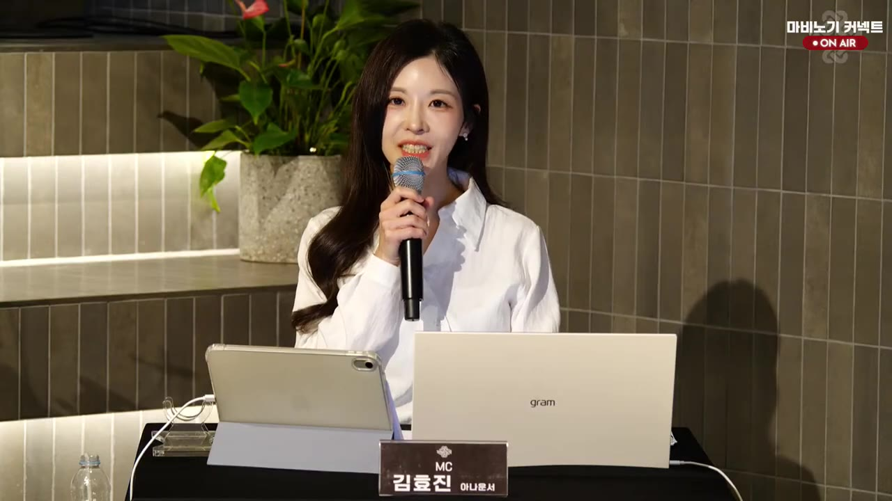
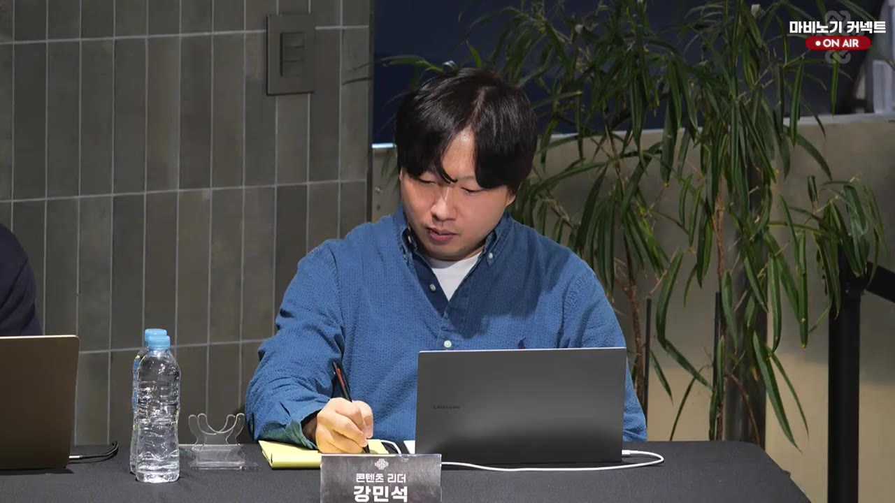
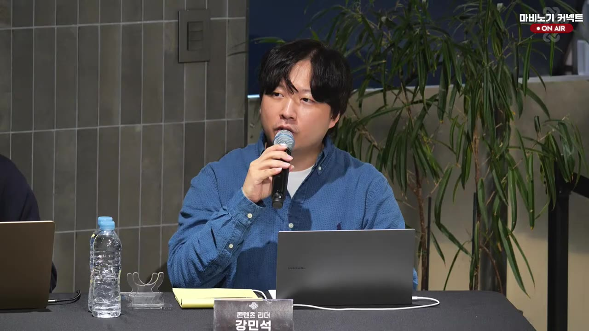
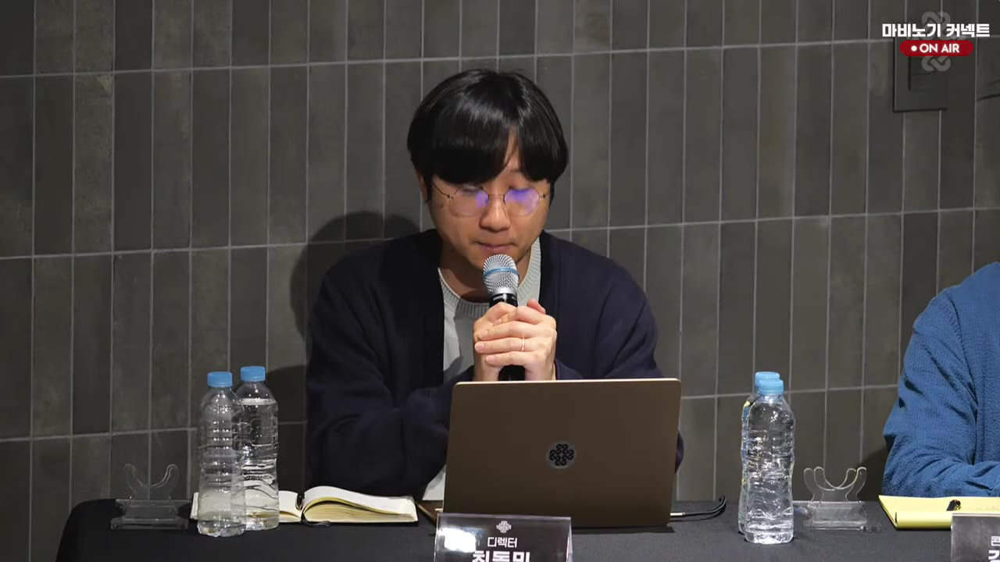
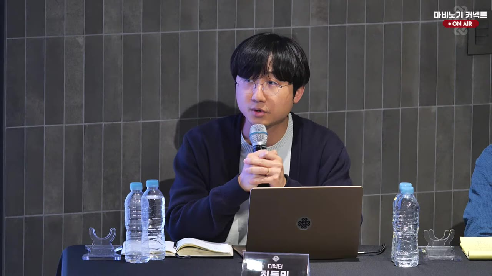

# YouTube Live 3부 요약

- URL: https://www.youtube.com/watch?v=BZrMrwcKHyw
- 영상: `[마비노기] 2026년 4월 25일 마비노기 커넥트 3부`
- 길이: 2:06:44
- 상태: 종료됨
- 작업 경로: `videos/BZrMrwcKHyw/`

## 핵심 요약

- 3부는 전날부터 이어진 장시간 Q&A의 마지막 구간으로, 알케믹 스팅어·다크메이지·블래스트 랜서·포비든 알케미스트·베리어블 거너·멜로딕 퍼피티어·퓨리파이터 등 아르카나별 밸런스와 사용성 문제가 집중적으로 다뤄졌다.
- 운영진은 상반기 밸런스 패치에 여러 조정을 묶어 반영하겠다고 반복 설명했다. 대표적으로 차징 스킬 예약, 다크메이지 신규 스택형 공격 스킬, 라이트닝 체인/프렌지 스왑 유지, 블랜·퓨파 전용 레이지 임팩트 대체 효과, 베리어블 거너 페이탈 스코프/연성탄 개선, 퓨리파이터 타이틀 스왑 완화 등이 언급됐다.
- 세공·유물·에코스톤처럼 기존 장비 가치와 직접 연결되는 항목은 신중한 입장이 많았다. 블래스트 랜서 한계돌파/7쿨모 완화는 현시점에서 어렵다고 했고, 멜퍼 2막 에코스톤은 기존 판단을 재검토하겠다고 했다.
- 포비든 알케미스트는 데미지 효율이 상위권이라는 점을 인정하면서도, 선남 유물 시너지 삭제는 기존 세팅 가치를 이유로 어렵다고 했고 카탈리스트 시너지는 조정 가능성을 열어 두었다.
- 멜로딕 퍼피티어는 튕김·그랜드 피날레 버그·에코마리오네트 명장 의존도·이펙트 가시성·영웅 환생 스탯 구조 등 성능 외 사용성/접근성 문제가 길게 논의됐다.
- 약 20시간 가까운 진행 이후 운영진은 체력·운영상 한계를 이유로 남은 안건은 추후 공지와 논의로 안내하겠다고 했고, 방송 종료 후 쿠폰 및 후속 공지를 예고했다.

## 타임라인 기반 질의/응답/출처 표

<table style="width: 100%; table-layout: fixed;">
<colgroup>
  <col style="width:8%">
  <col style="width:24%">
  <col style="width:58%">
  <col style="width:10%">
</colgroup>
<thead>
<tr>
  <th>시간</th>
  <th>질의</th>
  <th>응답</th>
  <th>출처</th>
</tr>
</thead>
<tbody>
<tr>
  <td>25:37~26:26</td>
  <td>3부 재개</td>
  <td>진행자는 새벽/아침까지 이어진 3부 시작을 알리고, 현장 조식이 준비되어 있다고 안내한 뒤 앞선 질의 흐름을 이어갔다.</td>
  <td style="word-break:break-all; font-size:0.85em;">videos/BZrMrwcKHyw/transcripts/chunk_01.txt videos/BZrMrwcKHyw/captures/frame_000001.jpg </td>
</tr>
<tr>
  <td>26:29~28:02</td>
  <td>활/석궁 차별점, 엘프 매그넘 이동</td>
  <td>활과 석궁은 종족 간 차별성을 명확히 하는 방향의 사양을 유지한다고 했다. 의미가 줄어든 정령 궁극기 등은 개선 필요 항목으로 인지 중이며, 엘프가 활을 들고 매그넘을 유지한 채 이동하는 개선은 다음 주 적용 예정이라고 답했다.</td>
  <td style="word-break:break-all; font-size:0.85em;">videos/BZrMrwcKHyw/transcripts/chunk_01.txt</td>
</tr>
<tr>
  <td>28:21~30:34</td>
  <td>알케믹 스팅어 버그/사용성</td>
  <td>하이드로피어스가 안 나가는 문제는 속성 고정 버그라기보다 조작 락 중 입력이 예약되지 않아 발생하는 문제로 설명했다. 차징 스킬 예약 기능을 개발 중이며, 보스 무적 처리 때 타게팅이 풀리는 문제도 무적 처리와 타게팅 유지가 함께 되도록 준비 중이라고 했다.</td>
  <td style="word-break:break-all; font-size:0.85em;">videos/BZrMrwcKHyw/transcripts/chunk_01.txt~chunk_02.txt videos/BZrMrwcKHyw/captures/frame_000002.jpg </td>
</tr>
<tr>
  <td>30:44~32:27</td>
  <td>프레임/주변 캐릭터 간소화 옵션</td>
  <td>60프레임 이하에서만 동작하는 주변 캐릭터 간소화 옵션을 더 높은 프레임 또는 상시 적용 옵션으로 제공해 달라는 요청에 대해, 기술 확인 후 정식 상시 적용 옵션 제공이 더 근본적인 방식이라며 그 방향으로 제공하겠다고 답했다.</td>
  <td style="word-break:break-all; font-size:0.85em;">videos/BZrMrwcKHyw/transcripts/chunk_02.txt</td>
</tr>
<tr>
  <td>32:42~37:32</td>
  <td>알케믹 스팅어 속성구슬/골든 타임/펫 자동 스킬</td>
  <td>사망 시 속성구슬 초기화는 유지되도록 반영해 빠르게 선보이겠다고 했다. 활을 든 채 골든 타임을 사용해 트라이 어썰트를 매끄럽게 굴리는 개선은 데미지 밸런스 문제가 없다면 반영하겠다고 했고, 특정 펫 소환 시 스킬까지 자동 사용할지 온/오프하는 구조도 구현 가능성을 확인해 안내하겠다고 했다.</td>
  <td style="word-break:break-all; font-size:0.85em;">videos/BZrMrwcKHyw/transcripts/chunk_02.txt</td>
</tr>
<tr>
  <td>37:54~44:58</td>
  <td>다크메이지 딜링, 신규 스킬, 스태프/원드, 유물</td>
  <td>다크메이지는 다른 아르카나보다 데미지 효율이 낮은 상황을 인정하고 상반기 밸런스 조정에 포함하겠다고 했다. 런지를 스택형으로 운용하는 제안과 관련해 스택형 공격 신규 스킬을 준비 중이라고 했으며, 스태프/원드 격차와 헤일로 등 특정 패턴 약세도 함께 고려한다고 했다. 썬더 후딜 중 무기 스왑/앵커 사용, 라이트닝 체인 유물 9~10레벨 효율 개선도 준비 중이라고 설명했다.</td>
  <td style="word-break:break-all; font-size:0.85em;">videos/BZrMrwcKHyw/transcripts/chunk_02.txt videos/BZrMrwcKHyw/captures/frame_000003.jpg </td>
</tr>
<tr>
  <td>45:00~50:01</td>
  <td>다크메이지 라이트닝 체인/세공/스톰</td>
  <td>라이트닝 체인·런지 유물은 현재 구조에 맞춰 더 효율적으로 바꾸는 방향이 가능하다고 했다. 장비 스왑 시 라이트닝 체인이 끊기는 문제는 상반기 밸런스 패치에 함께 반영 예정이며, 신규 스킬은 새 세공 추가가 아니라 기존 세공 중 덜 쓰는 부위를 활용하는 방향으로 옵션을 조정하겠다고 했다. 스톰 중첩 피해와 유물 지속시간 소수점 처리도 준비 중이라고 했다.</td>
  <td style="word-break:break-all; font-size:0.85em;">videos/BZrMrwcKHyw/transcripts/chunk_03.txt</td>
</tr>
<tr>
  <td>50:23~58:00</td>
  <td>블래스트 랜서 한돌/7쿨모, 위치렉, 차지 어썰트</td>
  <td>한계돌파·7쿨모 의존도 완화는 기존 장비 가치와 전투 사이클 경험을 이유로 현재 고려하지 않는다고 했다. 비한돌 저점 상향도 고점 과도 상승 우려로 어렵다고 답했다. 랜스 차지 위치렉은 서버 상태 영향이 커 완전 해결은 어렵지만 지속 개선 중이며, 차지 어썰트는 공격 범위 상향으로 명중률을 높이겠다고 했다.</td>
  <td style="word-break:break-all; font-size:0.85em;">videos/BZrMrwcKHyw/transcripts/chunk_03.txt</td>
</tr>
<tr>
  <td>1:00:00~1:08:59</td>
  <td>블랜/퓨파 레이지 임팩트, 블랜 콤카/헤비 스탠더</td>
  <td>레이지 임팩트 때문에 쌍검·쌍둔 스왑이 강제되는 문제에 대해, 블래스트 랜서와 퓨리파이터 각각에 레이지 임팩트와 중첩되지 않는 전용 증대 효과를 준비 중이며 상반기 밸런스 패치에 선보이겠다고 했다. 블랜 후딜·콤보카드 씹힘은 DPS 상승을 함께 고려해 조정 여부를 확인하고, 헤비 스탠더는 과열 게이지 활용 또는 주요 보스 근팅 제외안을 검토 중이라고 했다.</td>
  <td style="word-break:break-all; font-size:0.85em;">videos/BZrMrwcKHyw/transcripts/chunk_04.txt videos/BZrMrwcKHyw/captures/frame_000005.jpg </td>
</tr>
<tr>
  <td>1:09:23~1:15:42</td>
  <td>포비든 알케미스트 성능/시너지/인퓨전</td>
  <td>포비든 알케미스트의 데미지 효율이 상위권임을 인정하고 아르카나 간 균형을 잡는 방향을 내부 판단 중이라고 했다. 선남 유물 시너지는 기존 세팅 가치를 이유로 완전 삭제가 어렵다고 했고, 카탈리스트 시너지는 조정 준비 가능성을 열어 두었다. 엘레멘탈 인퓨전은 온/오프 가능 형태로 상반기 밸런스 패치에 준비 중이며, 보호 캡과 유물 보호 감소도 함께 감안하겠다고 했다.</td>
  <td style="word-break:break-all; font-size:0.85em;">videos/BZrMrwcKHyw/transcripts/chunk_04.txt~chunk_05.txt</td>
</tr>
<tr>
  <td>1:16:09~1:23:22</td>
  <td>베리어블 거너, 설치형 스킬 UX</td>
  <td>존 중첩 부담을 완화하고 래피드 파이어 피해를 균일화·압축해 몬스터 이동 영향을 줄이는 방향을 설명했다. 페이탈 스코프 전탄/키다운 발사, 연성탄 접속 시 충전 또는 비전투 자동충전, 슈터스 아이 지속시간 증가를 준비하겠다고 했다. 설치형 스킬이 보스·오브젝트 클릭에 막히는 문제와 즉시 설치 UX는 구현 가능성을 확인하고 선택형으로 제공하는 방향을 언급했다.</td>
  <td style="word-break:break-all; font-size:0.85em;">videos/BZrMrwcKHyw/transcripts/chunk_05.txt videos/BZrMrwcKHyw/captures/frame_000006.jpg</td>
</tr>
<tr>
  <td>1:23:40~1:32:45</td>
  <td>멜로딕 퍼피티어 명장/콤보카드/버그/에코스톤</td>
  <td>에코마리오네트 명장 의존도는 낮추는 방향으로 업데이트를 준비하겠다고 했다. 멜퍼 조작감·빗나감·콤보카드 의존성은 밸런싱과 하반기 콤보카드 개편, 표기 개선에 포함한다고 했다. 브리 레이드 튕김은 소환 로직·이펙트·타격 빈도 부하가 원인일 수 있으나 구체 계획은 아직 없고, 그랜드 피날레 쿨 미복귀 버그는 확인 후 수정하겠다고 했다. 2막 옐로우 에코스톤 3레벨 문제는 중첩 불가 20레벨화 또는 다른 방식이 더 긍정적인지 재검토하겠다고 했다.</td>
  <td style="word-break:break-all; font-size:0.85em;">videos/BZrMrwcKHyw/transcripts/chunk_05.txt~chunk_06.txt videos/BZrMrwcKHyw/captures/frame_000007.jpg </td>
</tr>
<tr>
  <td>1:33:41~1:40:24</td>
  <td>블랜 추가/베리어블 프렌지/멜퍼 접근성</td>
  <td>블랜 과열 에너지·엣지 반복 사용·투자 구간 의존 문제는 상반기 밸런스 조정에서 쾌적함과 데미지 균형을 함께 보겠다고 했다. 베리어블 거너 프렌지 효과 소실도 조정하겠다고 했고, 멜퍼 2막 에코스톤은 고점 확보가 아니라 고점을 막는다는 유저 설명을 들은 뒤 실제 문제가 없다면 반영할 수 있도록 검토하겠다고 했다. 색약 유저가 멜퍼 이펙트와 레데네미르 신창 이펙트를 구분하기 어렵다는 문제는 신창 이펙트 색상 변경 등으로 챙기겠다고 했다.</td>
  <td style="word-break:break-all; font-size:0.85em;">videos/BZrMrwcKHyw/transcripts/chunk_06.txt</td>
</tr>
<tr>
  <td>1:40:37~1:54:54</td>
  <td>퓨리파이터 성능/리스크/타이틀 스왑/버그/피어싱</td>
  <td>운영진은 모니터링 데이터상 퓨리파이터가 다른 아르카나와 유사한 수준이라고 봤지만, 근접 딜러 리스크 대비 리턴과 엘나 대비 기동/회피 차이를 상반기 밸런스 패치에서 고려하겠다고 했다. 타이틀 스왑은 의도한 플레이가 아니며 스왑 없이도 충분한 효율이 나오도록 개선하겠다고 했다. 60헤일로 피니시 대상 대시 펀치 행동불가 버그와 앵커 러시 무적 미적용은 확인하겠다고 했고, 의지/음식 의존은 근본 상향 방향으로, 피어싱·나이트브링어/소울 무기 옵션은 연관 요소를 확인해 조정 가능성을 보겠다고 했다.</td>
  <td style="word-break:break-all; font-size:0.85em;">videos/BZrMrwcKHyw/transcripts/chunk_06.txt~chunk_07.txt videos/BZrMrwcKHyw/captures/frame_000008.jpg </td>
</tr>
<tr>
  <td>1:55:11~1:57:09</td>
  <td>멜퍼 영웅 환생/스탯 구조</td>
  <td>멜퍼가 체력·솜씨 풀스탯을 위해 마스터시프 영웅 환생을 사실상 강제받는다는 지적에 대해, 특정 시기 또는 유료 환생에만 필요한 스탯을 얻는 구조는 조정이 필요하다고 인정했다. 현 구조 유지와 인형술 재능 환생에 옵션을 적용하는 완화안 중 방향을 정해 안내하겠다고 했다.</td>
  <td style="word-break:break-all; font-size:0.85em;">videos/BZrMrwcKHyw/transcripts/chunk_07.txt</td>
</tr>
<tr>
  <td>1:57:23~2:03:34</td>
  <td>종료 공지/남은 안건/쿠폰</td>
  <td>약 20시간 가까운 진행으로 더 이상 현장 진행이 어렵다고 설명하고, 남은 질문과 준비된 답변은 추후 공지와 논의로 안내하겠다고 했다. 디렉터는 전달된 의견을 차근차근 개선하겠다고 사과와 감사를 전했으며, 쿠폰 상세 내용은 방송 종료 약 2시간 뒤 공식 홈페이지 공지로 안내하고 쿠폰은 현시점부터 사용 가능할 것이라고 했다.</td>
  <td style="word-break:break-all; font-size:0.85em;">videos/BZrMrwcKHyw/transcripts/chunk_07.txt~chunk_08.txt videos/BZrMrwcKHyw/captures/frame_000009.jpg </td>
</tr>
</tbody>
</table>

## 음성 전사 요약

- 3부 초반은 활/석궁 종족 차별점과 알케믹 스팅어 사용성으로 시작됐다. 스킬 입력 예약, 타게팅 유지, 속성구슬 유지, 골든 타임 사용, 펫 스킬 자동 사용 등 실제 전투 흐름을 막는 조작 문제가 핵심이었다.
- 중반은 다크메이지와 블래스트 랜서의 구조적 불편이 중심이었다. 다크메이지는 신규 스택형 공격 스킬과 라이트닝 체인/유물 개선, 블랜은 한돌/7쿨모 가치와 비한돌 저점, 위치렉, 레이지 임팩트 대체 효과가 주요 쟁점이었다.
- 포비든 알케미스트와 베리어블 거너 구간에서는 상위권 데미지와 시너지 조정, 인퓨전 온/오프, 래피드 파이어 압축, 페이탈 스코프·연성탄·설치형 스킬 UX 개선이 논의됐다.
- 후반은 멜로딕 퍼피티어와 퓨리파이터가 길게 다뤄졌다. 멜퍼는 명장 의존도·튕김·그랜드 피날레·에코스톤·색약 가시성·영웅 환생 구조가, 퓨파는 실전 리스크 대비 리턴·타이틀 스왑·버그·피어싱/의지 의존이 핵심이었다.
- 끝부분에서 운영진은 장시간 진행 한계로 현장 Q&A를 종료하고, 남은 안건과 약속 이행은 공식 공지로 이어가겠다고 정리했다.

## 주요 화면 캡처

- 3부 재개 진행 화면

- 다크메이지/밸런스 답변 패널 화면

- 블래스트 랜서 및 공통 밸런스 답변 패널 화면

- 멜로딕 퍼피티어 질의 답변 패널 화면

- 퓨리파이터 질의 진행 화면

- 3부 마무리 답변 화면

## 최종 정리

- 3부는 1·2부에서 이어진 현장 Q&A를 마무리하는 성격이 강했고, 단순 질의보다 세부 전투 사이클·장비 가치·버그 재현·접근성 이슈가 많이 다뤄졌다.
- 운영진은 상반기 밸런스 패치에 즉시성 높은 사용성 개선을 묶어 넣겠다고 했지만, 세공·유물·한계돌파처럼 기존 자산 가치가 큰 항목은 보수적으로 접근했다.
- 가장 명확한 약속은 엘프 매그넘 이동 다음 주 적용, 차징 스킬 예약/타게팅 유지, 알케믹 속성구슬 유지, 다크메이지 신규 스킬, 라이트닝 체인/프렌지 스왑 문제 개선, 블랜·퓨파 전용 레이지 임팩트 대체 효과, 베리어블 거너 조작 개선, 멜퍼·퓨파 버그 확인 등이다.
- 명확히 보류 또는 신중 검토로 남은 항목은 블랜 한돌/7쿨모 완화, 포비든 선남 시너지 삭제, 멜퍼 2막 에코스톤 처리, 퓨파 피어싱/무기 옵션 조정 등이다.
- 방송은 약 20시간 진행 후 종료됐으며, 남은 안건과 쿠폰/후속 조치 세부 내용은 공식 홈페이지 공지로 넘겨졌다.
