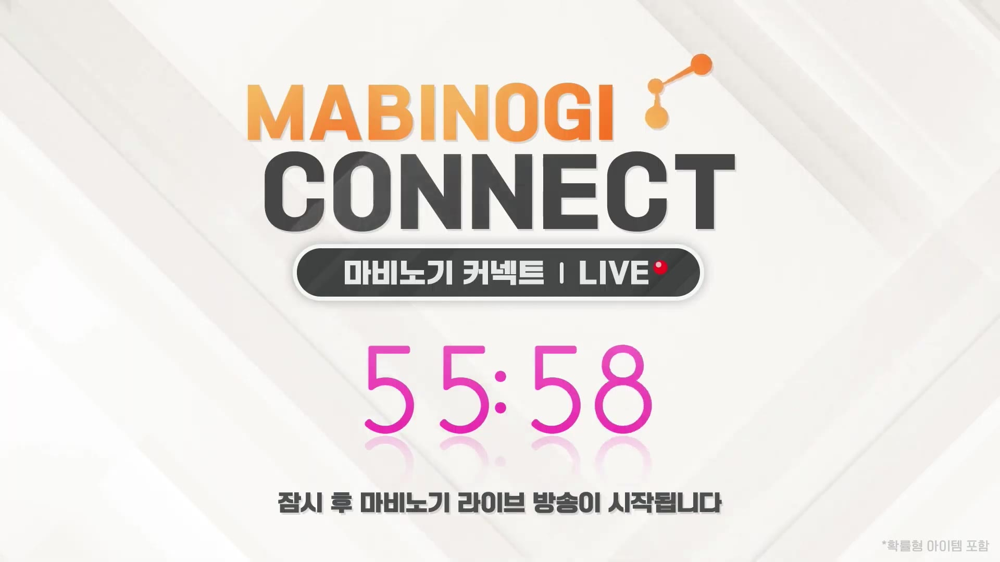

# YouTube Live 실시간 요약

- URL: https://www.youtube.com/watch?v=lSX4UvPFIZM
- 시작: 2026-04-25 23:31:10 KST
- 이미지 캡처 간격: 10초
- 오디오 전사 청크: 30초
- 상태: 진행 중

## 핵심 요약

- 마비노기 커넥트 LIVE는 생활 콘텐츠 중심의 Q&A로 진행 중이며, 핵심 쟁점은 명장/유리명장의 보상 구조와 공정성이다.
- 운영진은 명장을 골드만으로 얻는 구조를 피하려고 시간 + 골드 + 협회 코인 조합으로 설계했다고 설명했다.
- 서버 인구 차이와 기존 장비/세공의 영향은 완전히 제거하기 어렵지만, 생활 → 거래 → 전투로 이어지는 순환 구조는 유지하려는 기조를 밝혔다.
- 유리명장 혜택 개선은 우선순위로 잡았고, 구체 시기는 여름보다 하반기 쪽이 더 현실적이라고 답했다.
- 중후반부에는 제작물 유지기간, UX 개선, 보너스 데미지 3% 밸런스 논쟁이 이어졌고, 이후 야식/휴식 시간을 안내하며 대기 화면으로 전환됐다.

## 타임라인

| 시간 | 유형 | Q&A/화면 요약 | 근거 |
|---|---|---|---|
| 23:31:10 | 화면 | MABINOGI CONNECT LIVE 오프닝/대기 화면. 이후 동일한 휴식 화면이 이어지고 최신 화면에는 55:58 카운트다운과 “잠시 후 마비노기 라이브 방송이 시작됩니다” 문구가 보임. | `captures/frame_000196.jpg ` |
| 23:31:10~23:38:40 | 음성 | 명장 선발 구조 설명: 골드만이 아니라 시간과 협회 코인을 함께 써야 하며, 무한 점수화가 되지 않도록 설계했다고 답변. | `transcripts/chunk_000000.txt`~`chunk_000014.txt` |
| 23:38:40~23:43:40 | 음성 | 서버 인구수에 따른 난이도 격차와 정원 차등안은 서버 간 경제/랭킹 영향 때문에 어렵다고 설명. 특별 상점과 명장 심사 코인을 같은 자원으로 묶은 것도 의도된 선택이라고 밝혔다. | `transcripts/chunk_000015.txt`~`chunk_000029.txt` |
| 23:43:40~23:53:40 | 음성 | 환생시 체형 유지, 요리 명장 혜택, 제작물 유지기간, 에코마리오네트 제작 UX, 명장-전투 연계, 보너스 데미지 3% 논쟁이 이어짐. 유리명장 혜택은 먼저 개선하고 하반기 중 진행 가능성을 언급했으며, 생활 콘텐츠가 전투로 연결되는 순환은 유지하되 밸런스 문제는 인정했다. | `transcripts/chunk_000030.txt`~`chunk_000049.txt` |
| 23:53:40~00:03:50 | 음성/화면 | 진행 2시간가량 시점에 야식/휴식 시간을 안내하고 1시간 뒤 재개를 예고. 이후 오디오가 비고 최신 화면은 동일한 대기/카운트다운 화면으로 유지됨. | `transcripts/chunk_000050.txt`~`chunk_000065.txt` / `captures/frame_000196.jpg` |

## Q&A 주제별 정리

| 주제 | 질문/문제 제기 | 답변/약속 | 근거 |
|---|---|---|---|
| 명장 선발의 공정성 | 명장이 되려면 골드가 너무 많이 들고, 사실상 골드 많은 유저에게 유리한 구조 아닌가 | 시간 + 골드 + 협회 코인 구조로 설계해 무한 점수화를 막았고, 과도한 경쟁은 모니터링하겠다고 답변 | `transcripts/chunk_000000.txt`~`chunk_000014.txt` |
| 서버별 정원 차등 | 인구 많은 서버와 적은 서버의 난이도가 다르니 정원을 다르게 뽑아야 하는 것 아닌가 | 서버별 경제/랭킹/경매장 영향이 얽혀 있어 어렵고, 명장 메리트 약화 우려가 있다고 설명 | `transcripts/chunk_000015.txt`~`chunk_000027.txt` |
| 특별 상점과 심사 코인 | 특별 상점 이용에 생활협회 코인이 필요해 명장 도전 코인이 부족해지는 구조가 의도된 것인가 | 두 선택지 사이에서 가치를 판단하게 하려는 의도였다고 답변 | `transcripts/chunk_000018.txt` |
| 유리명장/환생 체형 유지 | 환생시 체형 유지 같은 편의 기능을 왜 명장 효과로 넣었고, 언제 개선되나 | 유리명장 혜택 개선이 전제이며 순차적으로 진행하되, 여름까지는 어렵고 하반기 중 개선을 검토하겠다고 답변 | `transcripts/chunk_000020.txt`~`chunk_000023.txt` |
| 제작물 유지기간과 UX | 명장 유지기간보다 제작물 유지기간을 늘리고, 에코마리오네트 제작 UX를 개선할 계획이 있나 | 제작 시기 기준으로 효과가 이어지는 방식이 더 자연스럽다고 보고 검토하겠고, 키트 판매나 사전 주문/위탁, UI 개선을 고려하겠다고 답변 | `transcripts/chunk_000030.txt`~`chunk_000041.txt` |
| 명장과 전투의 연계 | 생활 콘텐츠가 전투를 강제하고, 보너스 데미지 3%가 사실상 필수처럼 느껴진다 | 생활→거래→전투로 이어지는 순환을 강화하려는 목적이며, 강한 보상이라는 점과 밸런스 우려를 운영진도 인지하고 있다고 설명 | `transcripts/chunk_000042.txt`~`chunk_000049.txt` |

## 음성 전사 요약

- 명장 선발은 골드만이 아니라 시간과 협회 코인까지 쓰는 구조로 설계됐고, 무한 점수 누적을 막기 위한 장치라고 설명했다.
- 서버별 인구 차이로 경쟁 난이도가 달라지는 문제는 인정했지만, 서버별 정원 차등은 전체 경제와 랭킹에 미치는 영향 때문에 어렵다고 했다.
- 특별 상점과 명장 심사 코인을 같은 자원으로 묶은 것은 의도된 설계로, 유저가 무엇을 우선할지 선택하게 하려는 취지였다.
- 유리명장 혜택, 환생시 체형 유지, 제작물 유지기간, 에코마리오네트 제작 UX 개선 요구가 이어졌고, 운영진은 순차 검토 및 하반기 개선 가능성을 언급했다.
- 보너스 데미지 3%는 명장 메리트를 위한 강한 보상으로 넣었지만, 전투 유저에게 필수처럼 느껴질 수 있다는 우려도 함께 언급됐다.
- 마지막에는 야식/휴식 시간을 공지하며 1시간 뒤 재개를 예고했고, 이후 오디오는 비어 있었다.

## 주요 화면 캡처

- 최신 대기 화면은 마비노기 커넥트 LIVE 카운트다운과 재개 안내 문구를 보여준다.

  

## 최종 정리

- 명장 관련 Q&A의 중심은 공정성과 비용 부담이었고, 운영진은 골드 + 시간 + 협회 코인 구조로 설계했다고 반복 설명했다.
- 서버 인구 차이에 따른 난이도 격차는 인정했지만, 서버별 정원 차등은 전체 경제와 랭킹 구조 때문에 어렵다고 정리했다.
- 생활 콘텐츠의 편의성 이슈로는 유리명장 혜택, 환생시 체형 유지, 제작물 유지기간, 에코마리오네트 제작 UX 개선이 집중적으로 제기됐다.
- 생활 콘텐츠가 전투를 직접 강제하는 구조는 지양하되, 생활 → 거래 → 전투의 순환 자체는 강화하려는 방향이 확인됐다.
- 보너스 데미지 3%는 명장 메리트를 위한 강한 보상이라는 입장이었고, 밸런스 논란은 운영진도 인지하고 있었다.
- 진행 중간에 야식/휴식 시간이 안내됐고, 최신 화면은 55:58 카운트다운이 표시된 대기 화면이다.
